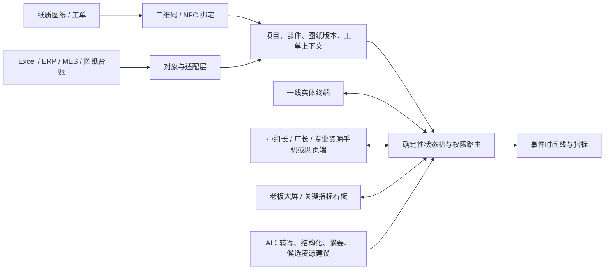
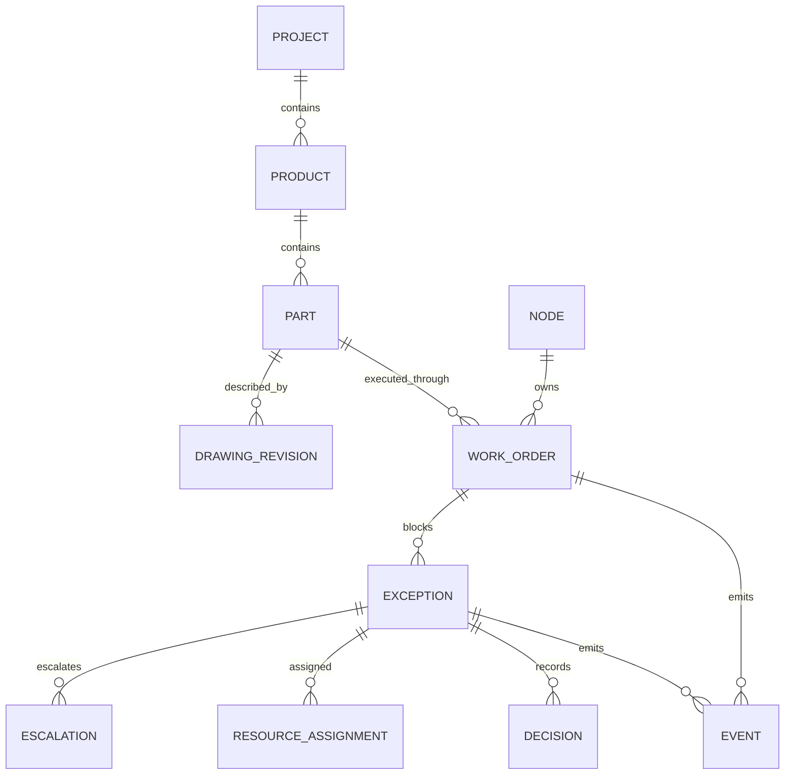

# AI 一线节点协同终端（智能工牌）产品立项及设计文档

## 文档信息

| 字段 | 内容 |
|---|---|
| 项目阶段 | 96 小时硬件黑客松原型 / 商业可行性验证前 |
| 长期产品边界 | 信息触达困难、人员和工位分散、异常依赖人工逐级协调的制造现场 |
| 首个验证场景 | 商业空间软装、店装柜台、展示道具等非标定制生产 |
| 产品形态 | 纸质图纸伴随层＋实体节点终端＋分层工作流＋AI 辅助＋角色管理端 |
| 购买者 | 工厂老板、厂长、生产负责人 |
| 核心使用者 | 制作/组装师傅、小组长、厂长、设计/采购/工艺/维修等专业资源 |
| 本期裁决 | **Build small：只验证一个纸质工单异常从现场上报到资源处理、再返回现场的完整闭环** |

### Change Log

| Version | Date | Change Description |
|---|---|---|
| 0.1 | 2026-08-27 | 首版立项与设计文档 |
| 0.2 | 2026-08-27 | 按真实非标定制工厂流程重构：取消鞋服限定；补充纸张伴随、四角色权限链、厂长资源调度、跨厂模块化和新版 96 小时验收闭环 |

## 目录

1. [执行摘要](#1-执行摘要)
2. [问题定义与证据](#2-问题定义与证据)
3. [目标用户与使用场景](#3-目标用户与使用场景)
4. [战略背景与立项理由](#4-战略背景与立项理由)
5. [产品定位与设计原则](#5-产品定位与设计原则)
6. [解决方案与产品架构](#6-解决方案与产品架构)
7. [核心业务流程与状态机](#7-核心业务流程与状态机)
8. [功能需求与验收标准](#8-功能需求与验收标准)
9. [成功指标](#9-成功指标)
10. [非本期范围](#10-非本期范围)
11. [依赖风险与缓解](#11-依赖风险与缓解)
12. [商业模式与壁垒路径](#12-商业模式与壁垒路径)
13. [开放问题与决策门槛](#13-开放问题与决策门槛)
14. [PRD 自评](#14-prd-自评)

## 1. 执行摘要

我们拟构建一套面向分布式制造现场的 **AI 一线节点协同终端**。首个验证场景是商业空间软装、店装柜台和展示道具等非标定制工厂：设计图纸仍然打印并交给制作、组装师傅查看；二维码/NFC 和实体终端为纸张增加可计算的项目、部件、图纸版本和工单身份，并承载确认、异常上报与处理结果反馈。

它本质上不是“一块智能工牌”，而是一套由同一任务、权限和状态引擎驱动的多端协同系统：师傅端承担极简高频动作，小组长、厂长和专业资源使用手机/网页处理队列，老板通过大屏或看板查看阻塞、返工和交付指标。不同端不是独立产品，而是同一任务流在不同角色上的最合适呈现。

产品不让师傅直接联系设计师，也不让 AI 自动越级派工。确定性工作流遵循工厂真实权责链：师傅向小组长上报，小组长判断是否升级，厂长决定调配设计、采购、工艺、维修等专业资源，处理结果再沿原责任链返回现场。AI 只负责整理语音、补齐上下文、生成摘要和提供候选资源建议；小组长与厂长保留升级和调度权。

96 小时版本只证明一件事：

> 一张纸质图纸/工单被数字绑定后，师傅可以在真实硬件上确认并用语音上报异常；异常按“小组长审核—厂长派工—专业资源处理—小组长确认—师傅收到反馈”的权限链闭环，工单恢复执行，系统留下完整时间线。

🔶 **Assumption：**相较于手机、PDA 或固定工位屏，随身或就近实体终端能显著降低师傅确认与上报的操作成本。该硬件必要性尚未经过对照测试。

## 2. 问题定义与证据

### 2.1 Who Has This Problem?

- 以项目交付为主、产品和部件高度非标、图纸与工艺经常随项目变化的中小制造工厂。
- 一线人员分散在制作、加工、组装和施工节点，日常主要依赖纸质图纸、小组长、电话或微信协同的班组。
- 需要跨设计、采购、工艺、维修等专业资源解决异常，但又必须遵循组织层级和现场调度权的厂长。

首个验证对象不是整个制造业，而是团队已能接触真实工单和案例的定制店装/软装工厂。

### 2.2 What Is the Problem?

设计师完成设计后，工厂会打印图纸并分发给零部件制作和组装师傅。纸张适合查看复杂图纸，却无法自动回答：

1. 当前纸张对应哪个项目、产品、部件和图纸版本，是否仍有效。
2. 哪位师傅已收到、理解并开始执行相关工单。
3. 现场异常是否携带了足够的项目、部件、版本和节点上下文。
4. 小组长是否已审核，厂长是否已派出正确资源，处理到了哪一步。
5. 结果是否经过责任链返回师傅，工单何时恢复，阻塞耗时发生在哪里。
6. 每个工序留下的“数字脚印”能否还原过程，让问题更早暴露并提前纠偏，而不是事后靠人回忆。

问题不是“师傅能否直接找到设计师”。真实问题是：在不能绕过组织层级的前提下，异常信息如何准确、完整、可追踪地进入正确责任链。

### 2.3 Why Is It Painful?

- **制作/组装师傅：**需要停下手头工作找小组长，重复解释图纸、部件和现场情况；等待期间可能继续错做或完全停工。
- **小组长：**承担信息翻译、初步判断、逐级汇报和结果回传；多项目并行时容易遗漏、误传或无法追踪。
- **厂长：**异常信息到达时上下文不全，需要再次问询；同时要判断该调设计、采购、工艺还是维修资源。
- **专业资源：**接到问题时可能缺少图纸版本、实物节点和前序决策，处理后结果又难以准确返回原工单。
- **工厂老板：**难以从大屏/看板看到错误版本、等待、返工和交付风险，也难判断新增 SaaS 或硬件是否真正改善经营结果。

### 2.4 Evidence Ledger

| Evidence | Type / Strength | Reading |
|---|---|---|
| 团队可接触一家定制店装/软装工厂的真实工单和案例 | 内部一手信息 / 中 | 提供可验证的场景入口；数据规模、授权范围和代表性仍待确认 |
| 设计图纸会被打印并交给制作、组装师傅 | 内部一手事实 / 中高 | 纸张是合理现场载体，产品应补充而非替代 |
| 师傅不能直接联系设计师；异常先到小组长，再由厂长调配资源 | 内部一手事实 / 中高 | 产品必须遵循分层权限，不可设计成扁平聊天或自动越级 |
| 市面已有 ERP/MES、家居制造软件、Connected Worker 平台和大量 To B SaaS | 公开事实 / 中 | “有软件”不是差异；硬件和工作流必须证明增量价值 |
| 当前缺少异常量、平均阻塞时长、错版返工率等基线 | 证据缺口 | 不能在立项阶段宣称 ROI |
| 当前缺少工牌与手机/PDA/固定屏的对照测试 | 证据缺口 | 不能把硬件形态当成已验证壁垒 |

详细市场与竞品证据见 [00-市场调研.md](./00-市场调研.md) 和 [01-竞品调研.md](./01-竞品调研.md)。

## 3. 目标用户与使用场景

### 3.1 Primary Persona：制作/组装师傅

- **Role：**按纸质图纸和工单完成部件制作、加工或组装。
- **Context：**双手被占用、移动频繁、可能戴手套；复杂图纸需要大幅面纸张查看。
- **Goals：**确认拿到的是正确版本；遇到问题时用最少动作向小组长说明；及时知道是否可恢复。
- **Pain points：**上下文要反复口述、等待结果不透明、错版或变更信息难以及时确认。
- **Current behavior：**看纸图、问小组长、电话或微信补充照片/语音，处理完成后靠口头通知。
- 🔶 **Assumption：**师傅愿意使用或佩戴终端，并认为减少找人和重复说明的收益大于被监控的顾虑。

### 3.2 Routing Persona：小组长

- **Role：**师傅的第一责任接口；判断问题能否在班组内解决，必要时升级厂长。
- **Goals：**快速获得完整上下文，减少重复追问；掌握本组阻塞队列；准确把结果返回师傅。
- **Permission boundary：**可以确认、补充、退回或升级异常；不能替厂长调配跨部门专业资源。
- **Product value：**结构化审核队列、升级动作、处理结果确认和反馈记录。

### 3.3 Orchestration Persona：厂长

- **Role：**跨项目、班组和职能资源的最终现场调度者。
- **Goals：**看懂异常影响、判断优先级、选择设计/采购/工艺/维修等资源并追踪处理。
- **Permission boundary：**保留资源指派、撤回和重新分配权；AI 只能建议。
- **Product value：**统一待调度队列、资源分派、阻塞时长和决策记录。

### 3.4 Specialist Persona：专业资源

- **Role：**由厂长指派的设计、采购、工艺、维修或其他责任人员。
- **Goals：**一次获得足够的工单、部件、图纸版本、异常描述和前序决策，提交明确处理结果。
- **Permission boundary：**只处理被指派事项；不直接向师傅下发生产指令，不改变原工单关键状态。
- **Product value：**结构化处理卡、补充材料、结果提交和可追溯责任边界。

### 3.5 Buyer Persona：工厂老板 / 生产负责人

- **Goals：**通过大屏/看板查看阻塞、错版、返工和关键交付指标，降低因信息不全和等待造成的损失。
- **Buying condition：**试点能给出可量化的阻塞时长、错版返工和部署成本变化。
- 🔵 **Open Question：**买方愿意为硬件入口单独付费，还是只愿意为整体协同结果付费？

### 3.6 Jobs-to-Be-Done

- **Functional job：**让异常带着正确工单与图纸上下文进入正确责任链，并把处理结果送回原执行节点。
- **Emotional job：**让师傅确信系统在帮助解决问题，而不是增加打卡和追责；让管理者确信关键状态没有失真。
- **Social job：**保持小组长与厂长的权责清晰，避免越级联系和多头指挥。

## 4. 战略背景与立项理由

### 4.1 Why This, Why Now?

- 团队已有真实非标定制工厂入口和较多工单/案例，比从陌生行业假设需求更适合 96 小时验证。
- ERP/MES、家居制造软件和通用协作平台已经很多；新项目必须从现有流程的“最后一线信息断点”切入。
- 低成本屏幕、二维码/NFC、语音识别和实时 Web 技术足以快速组合演示，但组合可行不等于商业成立。
- **Inference：**黑客松最有价值的证据不是功能数量，而是实体终端能否在不改变纸图习惯和组织层级的前提下，形成一次真实状态闭环。

### 4.2 Competitive Position

| Alternative | Existing strength | Our intended wedge |
|---|---|---|
| ERP/MES/家居制造软件 | 订单、计划、BOM、图纸和生产管理 | 作为一线事件与分层异常入口，不重做后台主系统 |
| 纸图＋小组长＋厂长＋电话/微信 | 低学习成本、灵活、符合真实层级 | 保留纸图，补上身份、版本、状态、升级和审计 |
| 手机/PDA/工位屏 | 成熟、成本可控、部署方式多 | 用更少动作、强反馈和节点绑定做对照验证 |
| Connected Worker 平台 | 工作流、低代码、AI 和多厂能力 | 聚焦中国中小非标工厂的纸张伴随与厂长调度配置包 |

### 4.3 Epic Hypothesis

> 我们相信，为非标定制工厂提供“纸质图纸数字绑定＋极简实体终端＋分层异常工作流”，能够让问题更早暴露、提高异常上下文完整率，并缩短从师傅上报到厂长派工、再到工单恢复的阻塞时间，因为现有流程的信息主要靠人工转述和个人记忆传递。若硬件入口不优于手机/PDA/固定屏，或层级化工作流只增加步骤，则产品假设不成立。

## 5. 产品定位与设计原则

### 5.1 Product Positioning

> 面向信息分散、人员和工位分布式的制造现场，AI 一线节点协同终端是一套可追溯的轻量级执行系统：它把纸质工单与图纸绑定为可追踪对象，让异常沿组织权限逐级升级、由厂长调配资源，并把结果可靠返回原执行节点。

首个验证场景是定制店装/软装工厂，不等于产品永久限定该行业。跨行业扩展必须通过第二家工厂的配置复用验证，而不是在文档中预先宣称。

### 5.2 What It Is / Is Not

| It is | It is not |
|---|---|
| 纸质图纸的数字伴随层 | 用工牌小屏替代完整图纸 |
| 分层异常上报与厂长资源调度系统 | 师傅与设计师直接聊天工具 |
| 实体节点终端＋确定性工作流＋AI 辅助 | AI 自动越级、自动派工或最终定责 |
| 可接在现有工单/MES/ERP 之上的事件层 | 新的全功能 ERP/MES/CAD/PLM |
| 用真实工厂楔子验证的通用底层产品 | 同时为所有工厂写死一套流程 |

### 5.3 Design Principles

1. **同一任务流，多角色呈现：**师傅端做极简高频动作；小组长/厂长用手机或网页；老板看大屏指标，所有端共享同一状态源。
2. **纸张与数字各司其职：**纸张负责复杂图纸展示；终端负责身份、版本、确认、异常和反馈。
3. **尊重权责链：**师傅只向小组长上报；小组长决定是否升级；厂长决定调配谁。
4. **一屏一个决定：**终端只显示当前工单、图纸版本/状态和一个主要动作。
5. **强反馈：**确认、阻塞、恢复和版本失效必须有清晰屏显、震动或灯光反馈。
6. **确定性状态优先：**权限、状态机、幂等和审计由工作流控制，不交给大模型。
7. **AI 建议、人类决策：**AI 整理、摘要、分类和建议；小组长与厂长做升级和派工。
8. **过程透明而非追责：**数字脚印优先用于早暴露、早纠偏和定位流程缺口，不默认用于处罚个人。
9. **不强迫逐厂改代码：**稳定能力进入核心模型，差异进入拓扑、字典、模板和适配器配置。
10. **工人先受益：**每次数据采集必须减少找人、等待或重复说明，不能只为管理看板服务。

## 6. 解决方案与产品架构

### 6.1 Product Components

### 6.2 Node Topology and Permissioned Routing

| Role | Can do | Cannot do |
|---|---|---|
| 师傅 | 绑定/确认工单、确认图纸版本、开始/完成、向本组上报异常、接收结果 | 直接联系或指派设计/采购/维修；越级改变处理人 |
| 小组长 | 查看本组异常、补充/退回/班组内解决、升级厂长、确认结果并通知师傅 | 未经厂长指派跨部门资源；修改图纸权威版本 |
| 厂长 | 查看升级队列、设优先级、指派/撤回/重派专业资源、记录决策 | 把 AI 建议当作无需确认的自动指令 |
| 专业资源 | 查看被指派事项、补充说明、提交处理结果 | 查看无关工单；直接改变师傅工单状态或绕过返回链 |

### 6.3 Architecture Responsibilities

| Layer | Responsibility | Must not do |
|---|---|---|
| 实体终端 | QR/NFC 识别、版本/状态显示、确认、异常触发、语音采集、强反馈 | 显示完整 CAD 或承载复杂管理后台 |
| 角色管理端 | 小组长审核、厂长派工、专业资源处理、时间线查看 | 用一个无权限差异的万能后台代替角色边界 |
| 老板看板 | 聚合阻塞、上下文完整率、确认、错版返工和交付风险 | 让老板直接越过厂长操作现场工单 |
| 工作流引擎 | 状态机、角色权限、路由、幂等、超时、撤回、审计 | 允许 AI 直接写关键状态 |
| AI 辅助层 | 转写、上下文合并、异常摘要、类型和候选资源建议 | 自动升级、自动派工、自动处罚或最终归因 |
| 对象/适配层 | 项目、产品、部件、图纸版本、工单映射；对接 Excel/MES/ERP | 把每家工厂字段硬编码进核心流程 |
| 配置层 | 节点拓扑、角色权限、异常字典、升级规则、界面字段、功能开关 | 宣称未实现的配置界面已经产品化 |
| 事件与指标层 | 记录谁、何时、针对什么对象做了什么；计算时长和完整率 | 用演示数据冒充真实工厂 ROI |

### 6.4 Core Domain Model

| Entity | Key fields | Relationship / purpose |
|---|---|---|
| Project | 项目 ID、客户、交期、状态 | 聚合一次店装/软装交付 |
| Product | 产品 ID、名称、所属项目 | 如柜台、展架或定制家具 |
| Part | 部件 ID、名称、所属产品、父子关系 | 连接零部件制作与总装 |
| Drawing Revision | 图纸 ID、版本号、生效状态、文件引用、变更说明 | 纸质图纸绑定的权威版本身份 |
| Work Order | 工单 ID、对象、节点、图纸版本、负责人、状态 | 执行和阻塞的主对象 |
| Node | 节点 ID、类型、班组、负责人、上下游 | 表示制作、加工、组装等分布式执行点；事件构成节点数字脚印 |
| Exception | 异常 ID、工单、部件、图纸版本、原始语音、结构化摘要、状态 | 师傅上报的现场问题 |
| Escalation | 来源角色、目标角色、原因、时间、上下文完整度 | 记录小组长升级厂长的动作 |
| Resource Assignment | 资源类型、被指派人、厂长、截止时间、状态 | 记录厂长的人工调度 |
| Decision | 决策人、选择、理由、依据、时间 | 保存升级、重派、接受/退回等关键判断 |
| Event | 事件 ID、对象 ID、操作者、角色、动作、前后状态、时间 | 幂等、可审计的时间线原子 |

Supporting entities 包括 Factory/Tenant、Person/Role、Team、Terminal、Attachment 和 Connector。96 小时原型可用单工厂数据，但 ID 和事件模型不得把工厂名称写死。

### 6.5 Entity Relationships

### 6.6 Cross-factory Modularity

跨厂能力按“稳定内核＋可配置差异＋适配器”实现，不以“每个工厂都支持”作空泛表述：

| Layer | Configurable content | Example in first scenario | 96h status |
|---|---|---|---|
| 稳定领域内核 | 项目、产品、部件、图纸版本、工单、异常、升级、派工、决策、事件 | 柜台项目—部件—图纸—工单—异常闭环 | P0 实现最小模型 |
| 节点拓扑 | 节点类型、上下游、所属班组、负责人 | 木作/五金/表面处理/预装/总装等节点 | P0 用配置数据，非完整控制台 |
| 权限与升级 | 谁可上报、审核、升级、派工、确认、关闭 | 师傅→小组长→厂长→专业资源 | P0 固定首个模板，底层保留配置字段 |
| 场景字典 | 异常类型、资源类型、必填字段、界面文案 | 错版、缺料、尺寸冲突、工艺不明、设备故障 | P0 使用 JSON/表格种子数据 |
| 载体绑定 | 二维码/NFC 规则、纸张模板、对象 ID | 纸图绑定 Drawing Revision 和 Work Order | P0 |
| 系统适配器 | Excel/ERP/MES/图纸台账字段映射、同步方向、失败重试 | 演示数据导入/导出 | P2；96h 仅模拟 |
| 终端能力档案 | 屏幕、按键、麦克风、震动、扫码/NFC 的能力开关 | 单台实体终端 | P0 单一档案 |

“支持不同工厂”的可验证门槛不是换 Logo，而是第二家工厂在不修改核心状态机的情况下，通过配置完成节点、角色、字典和字段映射。🔶 **Assumption：**大部分差异能被上述层次覆盖；目前尚无第二家工厂验证，不能宣称已形成跨厂复制壁垒。

### 6.7 Hardware Functional Design

| Capability | 96h Prototype | Production Direction |
|---|---|---|
| QR / NFC | 识别或模拟绑定纸质图纸/工单 | 防误绑、换版召回、批量制码 |
| Display | 项目简称、部件、图纸版本/有效状态、工单状态、单一主动作 | 强光可读、手套可操作、耐污易清洁 |
| Physical input | 至少完成确认和异常触发 | 盲操作、防误触、可撤回 |
| Voice | 采集一次异常语音并转为可编辑文本 | 噪声、方言、口罩环境测试 |
| Vibration / light | 新工单、阻塞、恢复、版本失效的分级反馈 | 现场提醒策略与勿扰规则 |
| Connectivity | 演示网络下同步真实状态 | 断网缓存、补传、设备健康监控 |
| Battery / charging | 支持完整演示 | 班次续航、集中充电与资产管理 |
| Full drawing display | 不支持 | 大图仍由纸张、平板或工位屏承担 |

## 7. 核心业务流程与状态机

### 7.1 Before Execution：纸图与工单绑定

1. 管理端建立项目、产品、部件、图纸版本、工单和执行节点的最小数据。
2. 为纸质图纸/工单生成二维码或写入 NFC 标签。
3. 师傅扫码/碰卡后，终端只显示对象摘要、版本号、是否有效和当前工单动作。
4. 师傅确认后，系统记录人、终端、工单、版本、节点和时间；纸图仍用于查看具体尺寸和结构。

### 7.2 P0 Exception Flow

1. 师傅在实体终端确认纸图/工单并开始执行。
2. 师傅发现异常，按键并语音描述；系统自动携带项目、部件、图纸版本、工单和节点。
3. AI 生成可编辑摘要和异常类型；师傅确认后，工单进入“阻塞”，异常进入本组小组长队列。
4. 小组长审核、补充或退回；无法在班组内解决时，人工升级厂长。
5. 厂长查看完整上下文，人工指派设计、采购、工艺、维修等专业资源。
6. 专业资源接单并提交处理结果；结果回到原责任链并对厂长可见。
7. 小组长确认结果可执行并通知师傅。
8. 师傅在终端收到强反馈并确认，工单恢复执行。
9. 全过程生成不可缺失的工序数字脚印和事件时间线，供厂长复盘、老板查看聚合指标。

### 7.3 Work Order State Machine

| Current state | Trigger | Next state | Authority |
|---|---|---|---|
| 草稿 | 发布并绑定有效图纸版本 | 待确认 | 管理端授权人员 |
| 待确认 | 师傅在终端确认 | 待执行 | 师傅 |
| 待执行 | 师傅开始 | 执行中 | 师傅 |
| 执行中 | 师傅确认异常上报 | 阻塞 | 师傅；系统只执行确定性状态变更 |
| 阻塞 | 小组长确认结果并通知师傅 | 待恢复确认 | 小组长 |
| 待恢复确认 | 师傅确认已收到 | 执行中 | 师傅 |
| 执行中 | 师傅提交完成 | 已完成 | 师傅；生产版可增加验收 |
| 任意非终态 | 撤回/取消 | 已取消 | 有权限的管理者 |

### 7.4 Exception State Machine

| Current state | Trigger | Next state | Authority |
|---|---|---|---|
| 草稿 | 师傅确认 AI/文本摘要 | 待组长审核 | 师傅 |
| 待组长审核 | 小组长判定需跨资源处理 | 待厂长调度 | 小组长 |
| 待组长审核 | 小组长给出班组内方案 | 待组长确认结果 | 小组长 |
| 待厂长调度 | 指派专业资源 | 已指派 | 厂长 |
| 已指派 | 专业资源接单 | 处理中 | 被指派资源 |
| 处理中 | 提交处理结果 | 待组长确认结果 | 被指派资源 |
| 待组长确认结果 | 确认可执行并通知师傅 | 待师傅确认 | 小组长 |
| 待师傅确认 | 师傅确认收到 | 已关闭 | 师傅 |
| 待组长确认结果 | 结果不可执行，退回 | 处理中 / 待厂长调度 | 小组长或厂长，按权限记录决策 |

状态机中的返回路径由厂长的 Resource Assignment 和原小组长关系决定；专业资源不能直接跳过小组长改变师傅工单。

## 8. 功能需求与验收标准

### 8.1 P0：96 小时必须交付

#### Story 1：纸图/工单数字绑定与版本确认

As a 制作/组装师傅, I want 用二维码或 NFC 识别纸质图纸和工单, so that 我能确认当前项目、部件和版本是否正确。

**Acceptance Criteria：**

- [ ] 每张演示纸图/工单关联唯一 Work Order ID 和 Drawing Revision ID。
- [ ] 真实终端能显示项目/部件摘要、版本号、有效状态和主操作。
- [ ] 失效版本有明确警示且不能被静默确认为当前有效版本。
- [ ] 系统不尝试在小屏上展示完整 CAD 或复杂图纸。

#### Story 2：师傅确认并语音上报异常

As a 制作/组装师傅, I want 用一次按键和语音上报异常, so that 我不用重复说明工单与图纸上下文。

**Acceptance Criteria：**

- [ ] 至少一次由真实硬件动作触发后端 Work Order 或 Exception 状态变化。
- [ ] 异常自动关联师傅、小组长、项目、部件、图纸版本、工单、节点和时间。
- [ ] 师傅确认上报后，工单进入阻塞，异常只进入本组小组长队列。
- [ ] 语音失败时可保留原始音频/文本并人工编辑，不丢失异常。

#### Story 3：AI 结构化但不越权

As a 小组长, I want 收到带原始语音和结构化摘要的异常, so that 我可以快速判断而不失去控制权。

**Acceptance Criteria：**

- [ ] AI 输出摘要、异常类型、缺失字段和候选资源类型，原始输入始终可查看。
- [ ] 低置信或字段冲突有明确提示，允许人工修改。
- [ ] AI 不能自动升级厂长、自动指派资源或直接关闭异常。
- [ ] AI 服务不可用时，确定性手工闭环仍可完成。

#### Story 4：小组长审核并升级厂长

As a 小组长, I want 审核本组异常并决定是否升级, so that 现场问题遵循真实责任链。

**Acceptance Criteria：**

- [ ] 小组长只能看到有权限的本组队列，能补充、退回、班组内处理或升级。
- [ ] 升级必须记录原因、操作者和时间，并携带完整上下文。
- [ ] 未经小组长升级的异常不会直接进入厂长待调度队列。
- [ ] 96 小时主演示必须实际完成一次“小组长→厂长”升级。

#### Story 5：厂长人工指派专业资源

As a 厂长, I want 根据异常和候选资源建议选择处理人, so that 我能保留跨部门资源调度权。

**Acceptance Criteria：**

- [ ] 厂长能查看升级来源、影响工单、阻塞时长和完整上下文。
- [ ] 资源指派必须由厂长明确确认，记录资源类型、被指派人、时间和状态。
- [ ] 厂长可以撤回或重派；每次变更保留 Decision 和 Event。
- [ ] 专业资源只看到被指派事项，不能直接改变师傅的工单状态。

#### Story 6：处理结果沿责任链返回并恢复工单

As a 小组长, I want 确认专业资源提交的结果并通知师傅, so that 师傅只在方案可执行时恢复工作。

**Acceptance Criteria：**

- [ ] 专业资源可以接单、提交结果和必要附件；操作人和时间可追踪。
- [ ] 结果对厂长可见，并按原 Resource Assignment 路由回原小组长。
- [ ] 小组长确认后，真实终端出现明确的恢复反馈；师傅确认后工单回到执行中。
- [ ] 结果被退回时工单保持阻塞，不得误恢复。

#### Story 7：完整事件时间线与演示重置

As a 厂长/老板/评委, I want 查看一条异常的完整时间线和关键指标, so that 我能验证硬件和每个角色都改变了真实业务状态，并能定位阻塞发生在哪个节点。

**Acceptance Criteria：**

- [ ] 时间线至少包含绑定、师傅确认、异常上报、组长审核、升级、厂长指派、资源接单/提交、组长确认、师傅确认和恢复。
- [ ] 每个事件包含唯一 ID、对象、操作者、角色、时间和前后状态；重复操作不重复入账。
- [ ] 看板能从同一事件源显示本次异常的总阻塞时长、当前责任节点和上下文完整状态。
- [ ] 任一失败步骤显示真实失败状态，不伪装成功。
- [ ] 演示数据可以安全重置，并连续完成 10 次端到端演练。

### 8.2 P1：P0 稳定后再做

- 图纸版本变更广播、旧版本召回和批量已读确认。
- 图片/短视频作为异常证据。
- 超时提醒和厂长队列优先级建议。
- 纸张打印模板和二维码批量生成。
- 第二套节点/异常字典配置，展示同一内核可换场景。
- 简单 Excel 导入导出或模拟外部系统回写。

### 8.3 P2：赛后探索

- 真正的 ERP/MES/PLM/CAD 图纸台账适配器。
- 完整多工厂配置控制台和版本化场景模板。
- 生产级离线同步、设备批量管理、远程升级、充电和资产管理。
- 经过授权和人工校验的异常知识库、解决方案推荐和资源负载辅助。
- 基于真实数据的错版返工、阻塞原因和交付风险分析。
- 与 PDA、工位屏、工业眼镜共用软件底层的多终端策略。

### 8.4 Constraints & Edge Cases

- 纸图二维码损坏、NFC 误碰或绑定对象不一致时，必须提示人工核验。
- 图纸版本失效后，不允许用缓存界面误显示为有效。
- 重复点击、网络重试和消息重放只能生成一个有效事件。
- 终端换人或换组后，不得访问上一人的工单与异常。
- 小组长离岗时必须由有权限者显式代班，不能自动越级给厂长。
- 厂长未指派资源时，AI 候选建议不能触发资源通知。
- 异常未关闭或结果被退回时，工单保持阻塞。
- 录音、图片、人员和绩效信息必须有授权、访问和保留策略；黑客松只使用脱敏/授权数据。

## 9. 成功指标

### 9.1 Primary Metric

**有效异常闭环率：**上报后完整经过规定权限链、返回原执行节点并恢复/关闭，且所有关键事件可追溯的异常比例。

- **Current：**🔵 Open Question：真实工厂没有结构化基线。
- **Prototype target：**同一演示脚本连续 10 次完成，关键事件和权限错误均为 0。
- **Pilot target：**需与工厂共同设定；在没有基线前不写虚假百分比提升。

### 9.2 Outcome and Diagnostic Metrics

| Metric | Definition | Current | Prototype / pilot use |
|---|---|---|---|
| 上下文完整率 | 异常中项目、部件、图纸版本、工单、节点、上报人和时间均有效的比例 | 🔵 未知 | 原型 10 次测试全部完整；试点采真实基线 |
| 组长升级耗时 | 师傅确认上报至小组长升级厂长的时间 | 🔵 未知 | 识别组长处理瓶颈，不追求无脑快速升级 |
| 厂长派工耗时 | 进入厂长队列至 Resource Assignment 创建的时间 | 🔵 未知 | 衡量资源调度响应 |
| 工单阻塞时长 | 异常上报至师傅确认恢复的总时间 | 🔵 未知 | 试点核心结果指标之一 |
| 节点确认率 | 应确认的工单/版本/处理结果中，被目标师傅确认的比例 | 🔵 未知 | 同时记录确认耗时与漏确认 |
| 错版返工率 | 因使用错误图纸版本产生的返工工单 / 相关工单 | 🔵 未知 | 需要工厂定义“错版”和返工口径 |
| 权限路径正确率 | 未发生越级、越权派工或无权限关闭的流程比例 | 无系统基线 | 原型必须 100% |

### 9.3 Guardrail Metrics

- 师傅完成确认/上报所花时间不能高于当前替代方式到不可接受程度。
- 不增加小组长和厂长的无效通知量；升级量与队列负载必须可见。
- AI 不直接产生派工、处罚、扣款、最终责任归因或图纸版本生效决定。
- 设备/网络故障不把工单错误标记为完成或已恢复。
- 不把预设演示数据、连续演练结果宣传为真实工厂 ROI。

## 10. 非本期范围

### Not Included in 96h Release

- **完整 CAD 解析、尺寸识别和小屏看图：**复杂图纸继续使用纸张或大屏。
- **生产级硬件：**不做工业认证、量产外壳、批量运维和完整续航验证。
- **真实 MES/ERP/PLM 接入：**本期只使用演示数据或模拟接口。
- **AI 自动派工和自动越级：**与真实权责链冲突，且风险不可接受。
- **师傅直接联系设计师：**明确不符合现有组织流程。
- **自动质量归因、扣款和绩效处罚：**证据与信任风险过高。
- **同时适配多个行业和工厂：**只验证一个真实场景模板；第二家工厂用于赛后验证模块化。
- **摄像头视觉质检和复杂数字孪生：**不服务于本期唯一闭环。

### Future Considerations

- 图纸版本变更广播、召回与重新确认。
- 基于真实处理记录的知识检索和候选方案建议。
- 多终端软件底层、系统适配器与场景模板市场。
- 在得到工人、管理层和合规授权后，探索质量和技能数据价值。

## 11. 依赖风险与缓解

### 11.1 Dependencies

- **Hardware：**至少一台可稳定显示、输入、反馈并触发真实后端状态的终端。
- **Workflow：**四角色权限、Work Order 与 Exception 状态机在 H4 前冻结。
- **Data：**准备一组脱敏项目—产品—部件—图纸版本—工单—异常—资源数据。
- **AI：**准备预设语音/文本与结构化 Schema；必须有手工降级。
- **Team：**三名成员分别负责产品/前端/演示、后端/AI/工作流、硬件/通信/集成。
- **Customer access：**赛后验证需要师傅、小组长、厂长和至少一种专业资源参与。

### 11.2 Risks & Mitigations

| Risk | Type | Impact | Mitigation / owner trigger |
|---|---|---:|---|
| 硬件不比手机/PDA/固定屏更好 | Value | 高 | 赛后做同任务对照；若无明显优势，转为多终端软件层 |
| 层级流程把厂长变成更大瓶颈 | Value / usability | 高 | 测量队列与派工耗时；允许组长班组内解决和厂长委派规则，禁止所有异常都升级 |
| 纸图与数字对象绑定错误 | Feasibility | 高 | 显示关键摘要和版本状态；失效/冲突必须人工核验 |
| 语音在噪声、方言下失败 | Feasibility | 中高 | 保留原音、可编辑转写与按键/文本降级 |
| AI 摘要漏掉关键条件 | Safety | 高 | 原文并列展示；低置信提示；人工确认后才进入工作流 |
| 不同工厂仍需大量改代码 | Viability | 高 | 第二家工厂做配置复用审计；记录核心代码改动与部署工时 |
| 工人认为设备用于监控 | Trust | 高 | 先展示问题解决价值；最小化数据；高风险用途不进入产品 |
| 96 小时链路过长 | Delivery | 高 | 先固定数据跑通手工权限链，再接 AI；按 H12/H24/H48/H60/H72 砍项 |
| 实体硬件故障破坏演示 | Demo | 高 | 单台主设备＋同数据模拟端＋离线录屏；但现场至少一次真实硬件事件 |
| 老板只为结果、不为硬件买单 | Viability | 高 | 以整体闭环和试点结果报价，分别测硬件购买/租赁/包含方案 |

## 12. 商业模式与壁垒路径

### 12.1 Business Model Hypotheses

以下均未验证：

- 🔶 **Option A：**终端租赁/押金＋按工厂或产线收取软件订阅，降低一次性采购阻力。
- 🔶 **Option B：**设备一次性采购＋年度平台/维护费。
- 🔶 **Option C：**按试点结果和部署范围收取方案费，硬件作为整体交付的一部分而非单独卖点。

🔵 **Open Question：**硬件 BOM、部署工时、售后、丢损和集成成本尚未测算，因此不能判断毛利与规模化模型。

### 12.2 Current Moat Assessment

| Capability | Current moat | Potential if validated |
|---|---|---|
| 工牌外形、屏幕、NFC、按键、震动 | 低，容易复制 | 主要是入口体验，不是独立壁垒 |
| 语音转写和大模型摘要 | 低，基础能力商品化 | 需由领域上下文和人工纠正数据增强 |
| 纸图/工单/版本绑定模型 | 低到中，尚未产品化 | 与现场部署方法结合可形成场景资产 |
| 分层节点拓扑与权限状态机 | 中等设计资产，未跨厂验证 | 若能配置复用，可形成产品化壁垒 |
| 厂长派工—处理—返回的决策数据 | 尚未积累 | 连续使用后形成难迁移的流程与知识资产 |
| 场景模板、适配器和实施方法 | 尚未形成 | 决定部署速度、毛利和复制能力 |
| 工厂信任与客户入口 | 早期关系资产 | 需转化为试点、续用和真实结果证据 |

结论：当前没有强壁垒，只有一个可能更贴近真实流程的产品楔子。硬件本身不是壁垒；长期壁垒必须来自可配置领域模型、真实决策/处理数据、系统适配器和低成本部署能力。

### 12.3 Moat-building Sequence

1. **证明入口价值：**实体终端在确认、上报或反馈中至少一项明显优于替代终端。
2. **沉淀首个场景包：**把节点、角色、异常字典、纸张模板和权限规则配置化。
3. **验证第二家工厂：**在不改核心状态机的前提下完成部署，量化配置复用率。
4. **建立适配器与实施方法：**减少字段映射、培训和上线工时。
5. **积累经人工纠正的数据：**异常上下文、厂长指派、处理结果和复发情况改善推荐质量。
6. **形成切换成本：**历史版本、事件时间线、配置和跨角色协同成为运营基础，而非靠硬件锁定。

## 13. 开放问题与决策门槛

| Question | Owner | Deadline | Status |
|---|---|---|---|
| 可用硬件是否同时具备 QR/NFC、麦克风、屏幕和震动；若不具备如何取最小交集？ | 硬件负责人 | H2 | Open |
| 真实案例中项目、产品、部件、图纸版本和工单的现有编码方式是什么？ | 产品负责人＋发起人 | H4 | Open |
| 演示采用扫码还是碰卡作为主绑定动作？ | 硬件＋产品 | H4 | Open |
| 小组长可在班组内直接解决哪些异常，哪些必须升级厂长？ | 发起人＋工厂小组长 | H8 / 试点前复核 | Open |
| 厂长当前的异常量、派工耗时和资源负载是多少？ | 发起人 | 试点前 | Open |
| 专业资源提交结果后是否需要厂长再次确认，还是系统留痕并直接回小组长？ | 厂长 | 试点前 | Open |
| 工牌相对手机/PDA/固定屏的核心优势动作是什么？ | 产品负责人 | 赛后 1 周 | Open |
| 计费按设备、产线、工厂还是试点结果？ | 商务/发起人 | 付费试点前 | Open |

### Go / No-Go Gates

- **Gate 1—Demo feasibility：**一台真实硬件能触发真实状态，四角色闭环连续演示 10 次；否则仅证明了软件原型。
- **Gate 2—Workflow fit：**师傅、小组长和厂长确认权限链与现场一致；若必须绕过层级才高效，应重新定义场景而非硬套流程。
- **Gate 3—Hardware value：**与手机/PDA/固定屏对照后，至少一个核心指标有显著优势；否则转为多终端软件产品。
- **Gate 4—Demand：**至少一家工厂愿意提供脱敏数据、现场负责人和测试时间；更强信号是承担设备或试点费用。
- **Gate 5—Productization：**第二家工厂主要通过配置完成，核心状态机无需重写；否则按项目制方案重新评估。

## 14. PRD 自评

### Strongest Section

**核心流程、权限边界与 P0 验收。** 本版已按真实工厂组织关系明确师傅、小组长、厂长和专业资源的职责，避免了“师傅直连设计师”和“AI 自动派工”的错误假设。

### Weakest Section

**真实基线与硬件必要性。** 当前没有结构化的异常数量、阻塞时长、错版返工率，也没有工牌与手机/PDA/固定屏对照，因此只能证明原型可行，不能证明 ROI 或产品壁垒。

### Top Assumptions to Validate

| # | Assumption | Section | Risk if Wrong | Proposed Validation |
|---|---|---|---|---|
| 1 | 实体终端显著降低确认/上报成本 | 1 / 11 | 硬件形态失去购买理由 | 四终端同任务对照，测时间、漏操作和满意度 |
| 2 | 分层数字工作流不会放大厂长瓶颈 | 3 / 11 | 系统增加等待而非减少等待 | 用真实异常影子运行，测各队列时长与升级比例 |
| 3 | 主要工厂差异可以配置覆盖 | 6 / 12 | 产品滑向高成本项目制 | 第二家工厂配置复用与核心代码改动审计 |
| 4 | 买方愿为整体协同结果承担硬件/订阅成本 | 3 / 12 | 商业模式不成立 | 带价格和部署条件的试点提案 |

### Recommended Next Step

在扩展功能前，从真实案例中选取一条可脱敏的“纸图—部件—异常—组长—厂长—专业资源—结果”记录，建立本期演示数据，并请一名小组长和一名厂长核对状态、权限和返回路径。

## 参考资料

- [00-市场调研.md](./00-市场调研.md)
- [01-竞品调研.md](./01-竞品调研.md)
- [03-96小时功能排期表.md](./03-96小时功能排期表.md)
