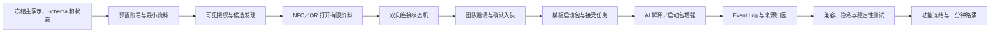

# COSPAN｜共域：96 小时功能排期表

> 本排期承接 [01-产品设计PRD.md](./01-产品设计PRD.md)。96 小时目标不是做出一个完整社交 App，而是交付一条可重复、可计量、有真实 NFC／QR 入口的有效协作连接闭环。

## 1. Strategy Context

### 1.1 本期目标

在 96 小时内完成：

```text
加入活动
→ 创建并授权协作身份
→ 团队发现互补候选人
→ NFC／QR 打开有限资料
→ 发起连接请求
→ 卡主确认
→ 若方向未定，由双方澄清意图并确认方向草案
→ 邀请并确认入队
→ 生成角色覆盖、风险和三个启动任务
→ 成员接受一个任务
→ 记录一条有效协作连接
```

### 1.2 唯一产品结果

评委能够确认：

1. 这不是一张会打开个人主页的 NFC 名片；
2. 这不是把 Tinder 换成开发者资料卡；
3. 产品把“当前可被发现—为什么适合—线下建联—双方同意—加入团队—马上开始”连成了同一条协作链路；
4. NFC 卡只是跨手机生态的可选入口，二维码和普通链接可以完成同一软件流程；
5. AI 只负责解释与生成建议，不自动建联、不自动入队，也不阻断主路径。

### 1.3 三人团队责任域

| Member | Primary responsibility | Core deliverable |
|---|---|---|
| **成员 A：产品／UX／移动前端／路演** | 范围、用户流程、页面、文案、验收、路演物料 | 资料、发现、请求、团队和启动包的移动端体验 |
| **成员 B：后端／数据／匹配／AI** | Schema、Auth、权限、状态机、API、匹配规则、LLM、Event Log | 确定性主链、AI 降级、幂等与可重置数据 |
| **成员 C：NFC／PWA／集成／测试** | 卡片写入、QR、落地页、Realtime／轮询、部署、兼容性、自动化与录屏 | 两类手机可打开、端到端集成、稳定演示环境 |

共同约束：

- 96 小时包括范围冻结、开发、联调、测试、路演和缓冲；
- H36 前必须跑通双向连接，H48 前必须跑通无 AI 的完整入队／任务闭环；
- 匹配先用规则，启动包先用模板，再接 LLM；
- 只使用一场活动、两个核心用户、一个项目、一个团队缺口和一张实体卡；
- H72 功能冻结；此后不新增页面、字段、模型能力或硬件形式；
- 每位成员必须保留正常睡眠／轮休，禁止把 H72–H96 当作补开发时间。

### 1.4 Seed Demo Data

为避免三人各自发明数据，H4 前冻结一套演示对象：

| Object | Demo content |
|---|---|
| Event | 2026 AI Hardware Hackathon，H0–H96 有效 |
| 用户 A | 林澈，硬件／嵌入式，未组队，有 1 个可点击项目证据 |
| 用户 B | 周闻，AI／后端，Idea 发起人 |
| Project | “离线会议洞察终端”，已有 AI／后端，缺硬件开发者 |
| Role Need | Hardware Builder，1 个席位 |
| Match reason | A 补齐硬件缺口；双方都对端侧 AI 感兴趣 |
| Risk | A 的现场可投入时间尚未确认 |
| NFC Asset | 绑定用户 A；与同卡 QR 指向同一落地页 |
| Starter tasks | 硬件选型、端侧数据链路、Demo 验收接口 |

---

## 2. Definition of Done

以下条件必须同时满足，才算 96 小时交付完成：

- [x] 用户 A 能加入预置活动并创建／编辑最小协作身份；
- [x] A 默认不可见，主动授权后才进入发现页，并有明确到期时间；
- [x] 用户 B 能看到 A 与 Project／Role Need 的匹配理由、证据和待确认点；
- [ ] 一张真实被动 NFC 卡写入 HTTPS NDEF URL，同卡拥有 QR 备用入口；
- [ ] 至少一台 iPhone 和一台 Android 能通过 NFC 或 QR 打开有限资料页；
- [ ] 未安装 App 的访问者也能查看有限资料；
- [x] B 发起连接后，A 可以接受、拒绝或拉黑；
- [x] 未接受前不能创建 Connection，重复触碰不能创建重复关系；
- [x] 项目方向未定时，双方确认方向草案前不能创建项目、邀请入队或生成任务；
- [x] B 只能向已连接的 A 发出 Team Invitation；
- [x] A 再次确认后才加入项目，已满席位不能重复加入；
- [x] 系统能生成角色覆盖、一个风险和三个首批任务；
- [x] LLM 超时或失败时，规则理由和模板任务仍能完成主链；
- [x] A 接受一个任务后，系统记录“有效协作连接”；
- [x] NFC、QR 和在线推荐来源能够在 Event Log 中区分；
- [x] 暂停可见、状态过期、卡片停用和拉黑路径至少各通过一次测试；
- [x] 所有关键状态由服务端校验，没有未确认建联或未确认入队；
- [x] 演示数据可一键安全重置；
- [ ] 连续 10 次三分钟主演示无阻断、无重复 Connection、无越权入队；
- [ ] 准备与现场版本一致的 90 秒离线录屏和 QR 兜底，但现场至少演示一次真实 NFC／QR 入口。

---

## 3. 功能优先级

### 3.1 P0：必须完成

| PRD ID | Initiative | Outcome | Acceptance signal |
|---|---|---|---|
| P0-01 | 活动与最小身份 | 用户能进入一个明确活动并创建可匹配资料 | 资料可编辑；AI 标签需确认；未授权不被发现 |
| P0-02 | 可见状态与隐私授权 | 用户控制范围、字段和有效期 | Hidden／Visible／Paused／Expired 状态正确 |
| P0-03 | 人／项目／缺口匹配 | 推荐有结构化依据且可解释 | 两条理由、一项证据、一个待确认点；AI 失败可降级 |
| P0-04 | NFC／QR 落地页 | 跨 iOS／Android 低摩擦进入 | 未安装 App 也可看；source 可区分；卡片可停用 |
| P0-05 | 双向连接确认 | 触碰不等于自动加好友 | 请求状态完整；Accepted 后才创建唯一 Connection |
| P0-06 | 项目、缺口与团队邀请 | 关系可转成明确团队 | 只邀请已连接用户；受邀者确认；缺口容量有效 |
| P0-07 | AI 团队启动包 | 组队后马上形成协作下一步 | 角色覆盖＋风险＋3 个任务；可编辑／接受；有模板降级 |
| P0-08 | 安全、限频与撤销 | 用户能控制骚扰和实体卡传播 | 限频、撤回、拉黑、停卡、过期重新校验 |
| P0-09 | Event Log、重置与可靠性 | 产品可计量且可重复演示 | 全链路事件、来源归因、一键重置、10 次稳定演示 |

### 3.2 P1：只有 P0 稳定后才做

| ID | Feature | Entry condition | Cut rule |
|---|---|---|---|
| P1-01 | GitHub／作品链接标题抓取 | H54 前主链 5 次成功 | 鉴权、限流或解析不稳立即砍 |
| P1-02 | 左右滑动交互 | 候选详情和请求按钮完全稳定 | H60 前未稳定改回普通列表 |
| P1-03 | AI 破冰问题 | 匹配解释已可靠 | 只生成一句；不得扩展聊天系统 |
| P1-04 | 启动包分享卡 | 启动包字段冻结 | 静态截图即可；不做模板编辑器 |
| P1-05 | 连接后见面备注 | Connection 主链稳定 | 只存一条文本；不做消息列表 |
| P1-06 | 赛后协作反馈入口 | H60 前 P0 全部完成 | 只演示入口；不做公开评分和推荐算法 |

### 3.3 P2：赛后探索

- 双端原生 App、正式 Universal／App Link 与推送通知；
- 多活动发现、附近状态和跨活动关系图谱；
- 更完整的 GitHub／作品集／比赛结果验证；
- 基于真实接受、入队、交付与复用结果训练匹配；
- 完整聊天、项目协作和第三方工具同步；
- 卡片预售、单场 Premium Pass、长期会员和正式支付；
- 动态 NFC、安全握手、主动电子胸牌和批量制卡；
- 主办方、招聘方、CRM 和企业管理后台；
- 公开人格评分、不可撤回信誉分或自动项目录用。

---

## 4. Critical Path



关键竖切优先级：

> **真实卡片／QR → 发起连接 → 对方确认 → 邀请入队 → 对方确认 → 接受任务。**

任何视觉、AI、数据导入或分享功能都不能抢占这条链路的时间。

---

## 5. 96 小时时间排期

| Time | Milestone | 成员 A：产品／UX／前端／路演 | 成员 B：后端／数据／匹配／AI | 成员 C：NFC／PWA／集成／测试 | Exit criteria |
|---|---|---|---|---|---|
| H0–H4 | 方向和数据冻结 | 冻结三分钟故事、页面地图、P0／非范围、演示文案和验收清单 | 冻结 Entity、API、Visibility／Connection／Invitation 状态和 Event schema | 清点手机、标签、写卡工具、域名与部署；确认 QR 兜底 | 三人能复述同一闭环；Seed data、状态表、接口约定签字确认 |
| H4–H12 | 工程骨架 | 建立移动端路由、共享组件、活动加入、资料与角色切换骨架 | 建数据库、Auth／演示账号、Seed、API、服务端状态校验和 reset 脚本 | 建部署流水线、卡片落地页骨架、NFC URL 与 QR；验证 HTTPS | 两个账号能登录；数据可重置；两台手机能打开同一 H5 |
| H12–H24 | 身份与发现竖切 | 完成最小资料、Visible／Paused UI、发现列表和候选详情 | 完成 Visibility Grant、Project、Role Need、硬筛选和初始规则分 | 写入真实卡片；完成有限公开页、source 参数和手机兼容测试 | B 能看到已授权 A；未授权／过期 A 不出现；卡片／QR 能打开 A 资料 |
| H24–H36 | 双向连接闭环 | 完成发起请求、请求箱、接受／拒绝／拉黑和状态反馈 | 完成 Connection Request／Connection 状态、幂等、限频和权限 | 接入 Realtime 或短轮询；测试重复触碰、断网、刷新和两台手机 | 不依赖 AI，真实卡片入口能跑通“B 请求 → A 接受 → 唯一 Connection”5 次 |
| H36–H48 | 无 AI 的完整组队闭环 | 完成项目卡、团队缺口、邀请、确认入队和模板启动包／任务接受 | 完成 Team Invitation／Membership、席位容量、模板 Pack 和任务状态 | 联调卡片→连接→入队→任务；完善错误提示和设备操作顺序 | 不依赖 LLM，完整主演示闭环连续 5 次成功；H48 前主价值已经存在 |
| H48–H60 | AI 与计量增强 | 完成 AI 匹配解释、启动包编辑、fallback 标识和事件调试视图 | 接入 LLM 结构化输出、超时／重试／模板降级；完成 Event Log 与有效连接计算 | 验证线上／NFC／QR 来源；做兼容矩阵和网络恢复；录制首版演示 | AI 失败不阻断；每个关键事件可还原；首次三分钟完整演示 |
| H60–H72 | 安全、减法与整合 | 冻结信息层级和文案；完成隐藏／过期／停卡／拉黑界面；所有 P1 可隐藏 | 修复权限、重复、过期竞态、AI 编造与 reset 问题；加关键日志 | 完成 iPhone／Android／QR 兼容测试、热点和投屏；准备备用标签 | 10 次中至少 8 次成功；未稳定 P1 全部删除或隐藏；无 P0 权限漏洞 |
| H72–H84 | 功能冻结与可用性测试 | 不新增功能；让 3–5 名非开发测试者独立操作；完成讲稿和答辩清单 | 功能冻结；只修阻断、数据损坏和权限错误；准备调试快照 | 连续压力演练；固定卡片、手机、网络、投屏和重置操作；完成 90 秒录屏 | 连续 10 次完整成功；测试者能理解“为什么推荐／为什么要确认” |
| H84–H92 | 交付包 | 完成一页问题图、一页闭环图、一页市场／壁垒图和三分钟演示控制表 | 导出演示 Event Log、架构图、AI fallback 和隐私校验说明 | 拍摄真实 NFC／QR 操作；检查电量、标签、热点、线缆和备用设备 | 文档、演示、录屏和答辩证据相互一致；无需联网也能解释方案 |
| H92–H96 | 最终缓冲 | 全流程彩排、删减讲解、锁定页面和数据 | 停止常规改动；只处理阻断级问题 | 充电、清洁、固定设备；只处理阻断 | 三分钟内完成；交付包锁定；不再新增任何内容 |

---

## 6. Work Breakdown by Module

| Module | DRI | Backup / fallback | Start | End | Dependency | Acceptance criteria |
|---|---|---|---:|---:|---|---|
| 主演示、Seed 与验收表 | A | B 校验数据 | H0 | H4 | 无 | 两人一项目一缺口一张卡；全员使用同一故事 |
| 数据模型与服务端状态 | B | A 走查业务 | H0 | H18 | Seed 冻结 | Visibility、Connection、Invitation、Membership 状态唯一且校验在服务端 |
| Auth／演示账号 | B | 预置角色切换 | H4 | H14 | 数据库 | 两台设备稳定登录；不因 OTP 阻塞主演示 |
| 移动端共享骨架 | A | C 支持落地页 | H4 | H16 | API 约定 | 一套代码覆盖资料、发现、请求、团队、我的 |
| NFC／QR 与落地页 | C | QR／普通链接 | H2 | H24 | HTTPS、card token | iPhone／Android 至少通过一种入口打开；有限资料和 source 正确 |
| 资料与 Visibility | A＋B | 固定资料／手工切状态 | H8 | H22 | Auth | 未授权不出现，暂停／过期即时重新校验 |
| 规则匹配 | B | 固定候选顺序 | H12 | H26 | 资料、Project、Need | 硬筛选正确；理由只引用已有字段 |
| Connection Request | B 主责，A 呈现 | 单页刷新 | H18 | H34 | Auth、状态机 | 发起、接受、拒绝、撤回、过期、拉黑和幂等可测 |
| Project／Role Need／Team | A＋B | 固定项目／一席位 | H28 | H44 | Connection | 仅已连接用户可邀请；确认后才入队；席位不超量 |
| 模板启动包与任务 | A | 固定 JSON | H34 | H46 | Membership | 角色、风险、3 个任务可展示；可接受一项任务 |
| AI 匹配解释与启动包 | B | 规则理由＋模板 | H44 | H58 | 结构化输入 | 超时可降级；不新增不存在事实；输出可编辑 |
| Event Log／有效连接 | B | 原始事件表 | H20 | H58 | 全部状态 | 来源、前后状态、actor、object、时间完整 |
| PWA／Realtime／轮询 | C | 显式刷新 | H16 | H54 | API | 请求和确认能在两台设备间可靠同步 |
| 安全与边界测试 | C 主责，全员参与 | 无 | H48 | H76 | P0 主链 | 过期、停卡、拉黑、限频、重复、竞态均通过 |
| 路演、录屏和答辩 | A 主责，全员参与 | 离线视频 | H60 | H96 | 稳定主线 | 3 分钟讲清问题、闭环、NFC 边界、商业风险和壁垒路径 |

---

## 7. Scope-cut Gates

### H12 Gate：工程骨架

- 若两个账号仍无法稳定进入：放弃真实 OTP，使用预置演示账号／角色切换；
- 若数据库或 Realtime 选型仍在争论：立即锁定一个托管方案，禁止重搭基础设施；
- 若 HTTPS 域名未就绪：优先解决部署，暂缓视觉系统和 AI；
- 停止品牌名、Logo、动画和卡片工业设计讨论。

### H24 Gate：身份、发现和卡片入口

- 若 NFC 在某类手机不稳定：保留 NFC 演示机型，所有其他机型明确使用 QR；
- 若公开页与登录耦合过深：允许未登录看有限资料，只把“发起请求”放在登录后；
- 若匹配规则未完成：使用固定候选顺序，但保留硬筛选和真实理由字段；
- 不允许为了滑动动画牺牲授权、过期或卡片落地页。

### H36 Gate：双向连接

- 若双向连接尚未稳定：停止项目美化、LLM、GitHub 抓取和全部 P1，只修请求状态、幂等和两端同步；
- 若 Realtime 不稳定：切换 2–3 秒短轮询或显式刷新，不在黑客松内修复杂推送；
- 若登录仍有外部依赖：固定两台设备的会话，不现场重新注册；
- 未经接受就能创建 Connection 视为阻断级漏洞。

### H48 Gate：完整无 AI 主链

- 若“连接→入队→任务”未完成：启动包改固定模板，只保留一个项目和一个席位；
- 取消左右滑动、作品抓取、分享图、见面备注和赛后反馈；
- 不允许为了保留 LLM 删除团队确认或任务接受；
- H48 后 AI 只能增强已有链路，不能引入新状态或新页面。

### H60 Gate：AI 与计量

- LLM 延迟高、结构不稳或编造：默认展示规则理由和模板 Pack，AI 结果只作为可选演示；
- Event Log 不完整：优先补事件，不再做任何 P1；
- NFC 与 QR source 不能区分：修正链接和埋点，不能宣称完成入口对照；
- P0 主链不稳定时，AI 从主演示移到录屏或答辩备用。

### H72 Gate：功能冻结

- 所有 P1 停止开发；无法稳定解释或不参与主演示的入口全部隐藏；
- 禁止新增字段、页面、AI prompt、硬件形态和第三方集成；
- 只允许阻断、权限、隐私、数据损坏、演示 reset 和兼容问题修复；
- 若 NFC 增加失败概率，主演示改 QR，NFC 作为可选能力单独展示。

### H84 Gate：交付冻结

- 停止所有非阻断改动；
- 演示内容、录屏、PRD、排期和路演口径必须一致；
- 不在路演中演示未进入 10 次稳定性测试的功能；
- 任何超出三分钟的讲解先删功能讲解，再删问题和结果表达。

---

## 8. Test Plan

### 8.1 Functional, Permission and Privacy Cases

| Case | Expected result |
|---|---|
| 用户未开启可见 | 不出现在发现页；卡片页不显示可连接状态 |
| 用户授权活动内可见 | 同活动候选可以发现，外部只看有限字段 |
| 到期／活动结束 | 自动 Expired，不再推荐；发起请求时服务端再次拒绝 |
| 用户暂停可见 | 已打开的旧页面不能绕过最新状态发请求 |
| NFC 读取成功 | 打开正确卡主页面，source=nfc，不能自动创建关系 |
| NFC 不可用，扫描 QR | 打开同一页面，source=qr，主链功能相同 |
| URL 被复制／远程打开 | 可以记录访问，但不声称发生真实线下接触 |
| 未登录访客 | 可看有限资料；发起请求前要求轻量登录 |
| 重复碰卡／重复点击 | 只存在一个有效请求和一个最终 Connection |
| A 接受请求 | 创建唯一 Connection；双方状态同步 |
| A 拒绝／拉黑 | 不创建 Connection；拉黑后双方不再互相推荐 |
| B 邀请未连接用户 | 服务端拒绝，不创建 Team Invitation |
| A 接受团队邀请 | 仅在缺口有效且有容量时创建 Membership |
| 两人同时占最后席位 | 只允许一个成功；另一人收到明确说明 |
| LLM 超时／返回错误结构 | 切换规则理由和模板 Pack，主链继续 |
| LLM 生成不存在能力 | 结果不得直接公开；使用结构化字段重新生成或回退 |
| 接受任务 | Event Log 记录，满足有效协作连接条件 |
| 卡片停用 | 新打开页面显示不可用；原 token 不继续暴露资料 |
| 网络短暂中断 | 不误报成功；可重试／刷新；不创建重复事件 |
| 演示重置 | 恢复相同 Seed 和初始状态，不残留前次 Connection |

### 8.2 Device Compatibility Matrix

| Device / path | Must test | Pass condition |
|---|---|---|
| iPhone＋NFC | 系统通知、解锁、Safari／H5 | 能从真实标签进入正确页面 |
| Android＋NFC | NDEF URI、浏览器／应用选择 | 能从真实标签进入正确页面 |
| 任意手机＋QR | 相机扫码和浏览器 | NFC 失败时可完成全部流程 |
| 未安装 App | H5 页面 | 可看有限资料并进入登录／请求 |
| 已登录两台设备 | 请求同步 | 一端发起、一端确认、状态一致 |
| 手机热点 | 弱网络 | 页面有 loading、失败和重试，不误报成功 |

### 8.3 Analytics Verification

- 每次完整演示后检查事件数量、顺序、actor、object 和 source；
- NFC 和 QR 各跑至少 3 次，确认来源不混淆；
- 重复操作确认不会重复计算 Connection 或有效协作连接；
- AI fallback 事件需记录 `fallback_used=true`；
- reset 只删除／恢复演示数据，不影响配置和卡片映射；
- 在录屏前导出一次完整 Event Log 作为答辩证据。

### 8.4 Demo Reliability

- 三名成员各自完整执行主演示至少 2 次；
- 邀请 3–5 名不了解代码的人按任务卡操作，记录卡点和误解；
- 连续执行 10 次，记录耗时、失败点、恢复方式和是否产生重复／越权事件；
- 在现场预计使用的手机、浏览器、网络、投屏和灯光下至少彩排一次；
- 备份两张已写入卡、两份 QR、两个预登录账号、一个热点和一条 90 秒离线视频；
- 录屏展示的功能不得超过现场交付版本。

---

## 9. Three-minute Demo Script

| Time | Presenter action | Audience takeaway |
|---|---|---|
| 0:00–0:20 | 展示黑客松现场群聊：有人找队、团队缺硬件，但信息迅速被淹没 | 问题不是没有联系方式，而是不知道谁现在适合谁 |
| 0:20–0:40 | A 开启“未组队、活动内可见”，展示硬件能力和项目证据 | 身份是临时授权、证据化且可撤回的 |
| 0:40–1:00 | B 的项目缺硬件，发现页推荐 A，展示两个理由和一个待确认点 | AI 匹配的是人、项目和团队缺口，不是只刷标签 |
| 1:00–1:20 | B 现场碰触 A 的 NFC 卡，H5 打开有限资料并发起连接 | 卡片解决跨生态发起，接收方无需先安装 App |
| 1:20–1:40 | A 的请求箱收到请求；A 接受后 Connection 成立 | 碰一下不等于自动加好友，双方保留同意权 |
| 1:40–2:05 | B 邀请 A 加入项目的 Hardware Builder 席位；A 再次确认 | 联系人真正转化成有角色的团队成员 |
| 2:05–2:30 | 展示角色覆盖、风险和三个启动任务；A 接受硬件选型任务 | 产品从“认识”继续到“开始协作” |
| 2:30–2:45 | 展示 Event Log：NFC 来源、双方确认、入队、任务接受 | 整条链路可归因、可验证、可做 NFC／QR 对照 |
| 2:45–3:00 | 说明长期身份：项目结果反哺下一次匹配；NFC 可删除 | 壁垒来自协作结果和网络密度，不来自卡片 |

### 9.1 Demo Reset Procedure

1. 点击受保护的 Demo Reset；
2. 确认用户 A 为 Visible，用户 B 为 Project Owner；
3. 确认不存在有效 Connection、Invitation 或 Membership；
4. 确认 NFC card token 为 Active，QR 与 NFC 链接一致；
5. 两台手机保留登录态并回到指定起始页；
6. 清除浏览器旧标签页，检查热点和投屏；
7. 用二维码快速预跑一次落地页，再开始正式展示。

---

## 10. Team Operating Plan

### 10.1 Ownership Rules

- 每个模块只有一个 DRI；协作不等于三人同时改同一关键文件；
- 状态名、字段和事件只能以共享 Schema 为准，前端不得自行发明状态；
- AI prompt 不能改变服务端关键状态；
- 每 6 小时进行一次 10 分钟同步，只讨论阻断、依赖、砍项和下一 Exit criteria；
- 每次跨模块合并后，至少跑一次从卡片到任务的 smoke test；
- H72 后每个阻断级修改由改动者和受影响模块负责人共同验证。

### 10.2 Suggested Shift Rhythm

| Period | A | B | C | Shared checkpoint |
|---|---|---|---|---|
| H0–H24 | 主流程和移动端 | Schema、Auth、匹配 | 部署、卡片、落地页 | H12／H24 Exit review |
| H24–H48 | 请求、团队、任务 UI | Connection、Team 状态 | 两机同步、兼容联调 | H36／H48 full-path review |
| H48–H72 | AI 呈现、计量页、文案 | LLM、Event Log、修权限 | 兼容、安全、演示环境 | H60／H72 freeze review |
| H72–H96 | 可用性、路演、物料 | 阻断修复、日志、证据 | 压测、录屏、设备与网络 | 每 4–6 小时彩排 |

---

## 11. Roadmap (Now / Next / Later)

| Stage | Initiative | Outcome | Metric | Decision rule |
|---|---|---|---|---|
| **Now：96h** | 单场活动有效协作连接闭环 | 证明授权、匹配、线下入口、双向确认和启动协作可以连通 | 10 次稳定演示；0 未确认建联／入队；事件完整 | 黑客松交付，不代表 PMF |
| **Next：1 周** | 12–15 人可用性测试 | 验证资料、匹配解释、确认和启动包是否被理解 | 任务完成率、耗时、错误点、授权意愿 | 无法独立完成则先修体验，不扩功能 |
| **Next：首场活动** | NFC／QR／普通链接同场对照 | 判断实体卡的真实增量 | 打开率、请求率、确认率、完成时间 | 无明显增量则 NFC 退出核心故事 |
| **Next：活动后 7／30 日** | 关系和项目复用观察 | 判断黑客松之外是否有长期产品 | 更新资料、再次匹配、项目／任务行为 | 无复用则收缩为活动工具或停止 |
| **Next：付费验证** | 卡片预售＋单场 Premium 假门／订金 | 判断个人是否愿意付费 | 真实支付／订金，不看口头兴趣 | 无支付不开发订阅系统 |
| **Later** | 跨活动协作身份和结果图谱 | 用项目结果提高匹配质量和留存 | 重复合作、交付、再匹配表现 | 必须由真实活动数据驱动 |

---

## 12. Risks & Dependencies

| Risk / dependency | Why it matters | Response |
|---|---|---|
| 三人同时做五个页面导致前端过载 | 主流程页面虽多但状态相似 | 共享 Card／Status／Action 组件；A 主 App，C 主落地与集成 |
| Auth／OTP 在现场阻塞 | 接收方无法快速发起请求 | 预置账号、保留登录态；真实产品登录方式赛后验证 |
| NFC 行为随机型变化 | 评委手机可能无法顺畅打开 | 不使用评委手机跑关键路径；同卡 QR；明确技术边界 |
| Realtime 不稳定 | 双方确认看似无响应 | 轮询／显式刷新；不依赖推送服务 |
| LLM 结果慢或编造 | “AI”反而破坏可信度 | 规则排序、结构化输入、超时、模板降级和用户编辑 |
| 数据权限只做在前端 | 可绕过双向确认或入队 | 关键写操作全部服务端校验 |
| 产品退化成数字名片 | 无法说明持续价值 | 主演示必须完成入队和任务接受 |
| 产品退化成赛事 SaaS | 偏离完全 To C 定位 | 不做主办方控制台和企业线索 |
| 现场测试没有足够用户 | 无法验证网络密度 | 96h 只验证可用性；赛后单独安排真实活动试点 |
| 低频与无付费 | 独立产品商业性不足 | 文档明确为待验证，不用硬件收入掩盖留存风险 |

---

## 13. Final Deliverables Checklist

### Product

- [ ] 一套部署到 HTTPS 的移动 H5／PWA；
- [x] 四个预置用户；项目创建后可生成一个角色缺口和三个模板任务；
- [ ] 一张真实 NFC 卡及同链接 QR；
- [x] 手机 Demo 已覆盖资料、发现、候选详情、连接、协作启动舱和“我的”；真实后端覆盖活动加入、卡片落地、请求箱、团队与启动包；
- [x] 外部平台链接保存／删除、GitHub 公开元数据降级、手机前台真实定位、距离分桶与离页撤销；
- [x] Visibility、Connection、Team Invitation、Membership、Starter Pack、Task 和 Project SOS 的服务端状态；
- [x] 确定性解释＋三任务 `TEMPLATE_FALLBACK`；
- [x] Event Log、来源归因和受保护 Demo Reset；
- [x] 暂停、过期、拉黑、停卡、限频和角色容量竞态路径。

### Quality

- [ ] iPhone／Android／QR 兼容记录；
- [x] 48 个后端 HTTP 测试＋手机 Smoke Test＋真实浏览器定位／平台链接 E2E；
- [ ] 连续 10 次主演示记录；
- [ ] 3–5 名非开发测试者可用性记录；
- [ ] 90 秒同版本离线录屏；
- [ ] 两张备用标签、两份 QR、备用热点、电源和线缆。

### Presentation

- [ ] 三分钟讲稿和逐秒操作卡；
- [ ] 一页问题／现状替代流程；
- [ ] 一页产品闭环；
- [ ] 一页系统与 NFC 边界；
- [ ] 一页市场、商业化风险与壁垒路径；
- [ ] Event Log 截图或实时调试视图；
- [ ] 答辩清单：为什么不是微信、为什么不是数字名片、为什么需要确认、NFC 有何增量、如何留存、谁付费、壁垒是什么。

---

## 14. Source Documents

- [00-项目导航与方向决策.md](../00-项目导航与方向决策.md)
- [00-市场行业调研.md](./00-市场行业调研.md)
- [01-产品设计PRD.md](./01-产品设计PRD.md)
