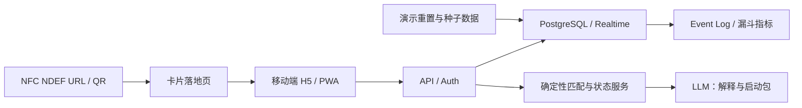

# RALLY｜集结：技术架构与 NFC 方案

> 本文承接 [01-产品设计PRD.md](./01-产品设计PRD.md) §8／§9／§13.3 与 [02-96小时功能排期表.md](./02-96小时功能排期表.md) §6／§8，把其中的架构决策深化为可实施的工程方案。PRD 定义"做什么和验收什么"，本文定义"怎么实现"。任何与 PRD 冲突之处以 PRD 为准，并回写修订本文。

## 文档信息

| 字段 | 内容 |
|---|---|
| 文档目的 | 96 小时 MVP 的工程实施依据＋赛后生产化路径的技术边界 |
| 首要约束 | 确定性主链：筛选、权限、状态、幂等由规则控制，大模型失败不能阻断建联与入队 |
| 交互终端 | 手机是唯一完整交互终端；推荐、附近发现、名册和协作操作均在手机端 |
| 硬件边界 | NFC 卡是可选入口；QR 与普通分享链接必须能独立完成同一软件闭环；工牌不扫描附近人员 |
| 隐私底线 | 手机号／微信号／邮箱默认不公开；未授权资料曝光次数为 0 |

---

## 1. 总体架构

### 1.1 组件视图



### 1.2 技术选型与锁定规则

| 层 | 96h 选型 | 决策规则 |
|---|---|---|
| 前端 | 一套响应式 Web／PWA，覆盖两台手机与投屏 | 不做原生双端（导航 D-05） |
| 后端 | Supabase／Firebase 或等价托管，直接用现成 Auth、DB、Realtime | H12 Gate：选型仍有争论立即锁定一个托管方案，禁止重搭基础设施 |
| 数据 | PostgreSQL 或等价结构化存储 | 关键状态全部服务端校验，前端不得自行发明状态 |
| AI | 一个结构化输出接口 | 只做匹配解释与启动包；超时／失败必须模板降级 |
| 卡片 | 普通 NTAG 类被动标签写 HTTPS NDEF URL，同卡印 QR | 不做手机对手机 NFC、不做主动电子胸牌 |
| 部署 | 一个公网 HTTPS 域名 | 现场备手机热点与同版本 90 秒离线录屏 |

### 1.3 架构红线

1. **AI 不进入状态主链：** AI prompt 不能改变服务端关键状态；Visibility／Connection／Team Invitation／Membership 的状态迁移只能由规则代码触发。
2. **关键写操作全部服务端校验：** 权限只做在前端视为阻断级漏洞（排期 §12）。
3. **硬件可删除：** 去掉 NFC 卡后，QR 与分享链接必须完成同一闭环（导航 D-03／PRD 设计原则 10）。
4. **页面打开不建关系：** 卡片落地页只记录 `card_landing_opened`，不创建任何 Connection。
5. **高功耗发现只在手机前台：** 赛后若实现 BLE 附近发现，它只能作为手机发现页的限时会话；离开页面、锁屏或授权到期后停止。数字工牌不承担扫描、排序或名册浏览。

---

## 2. 数据模型落地

以 PRD §8.1 的核心实体为准，落地为以下表结构与关键约束。字段只列工程上必须的部分；96 小时 P0 仍以建联主链为先，方向谱系和 Leader 任期属于协作空间扩展模型。

### 2.1 核心表

| Table | Key fields | 关键约束 |
|---|---|---|
| users | user_id PK、昵称、头像、登录标识 | 登录方式按 PRD §15 开放问题 2 在 H4 前定 |
| events | event_id PK、名称、起止时间、邀请码 | 种子事件有效期须覆盖主演示时间（排期 §1.4） |
| profiles | user_id FK、当前状态、能力标签（3–5）、兴趣、投入时间、协作偏好 | 当前状态枚举：未组队／有 Idea 找人／团队缺人／已组队但可交流 |
| visibility_grants | user_id FK、event_id FK、范围、公开字段、开始／到期时间、状态 | 状态：Hidden／Visible／Paused／Expired；默认 Hidden |
| evidences | evidence_id PK、user_id FK、类型、URL、标题、验证状态 | 无证据的能力标签必须标记"自我声明"；删除证据后旧匹配理由不得继续引用 |
| projects | project_id PK、created_by FK、event_id FK、一句目标、主题、阶段 | created_by 只记录创建动作，不等于项目发起归属、永久 Owner 或 Leader |
| project_origins | project_id FK、originator_id FK、类型、确认状态、created_at | 支持共同发起；确认后只追加更正，不原地覆盖 |
| project_directions | direction_id PK、project_id FK、parent／supersedes、目标用户、问题、结果、状态 | 用 Pivot／Fork 保存 A→B 演进；完全独立方向不得覆盖旧方向 |
| direction_origins | direction_id FK、originator_id FK、类型、确认状态 | 每个方向独立记录 0→1 发起者，不从项目发起人自动继承 |
| leadership_terms | term_id PK、project_id、direction_id、leader_id、开始／结束、产生方式 | Leader 绑定方向／阶段任期，可交接，不改变发起归属 |
| role_needs | role_need_id PK、project_id FK、角色、说明、数量、状态 | 每项目最多 3 个缺口；MVP 每缺口 1 人（PRD §15 开放问题 5） |
| match_candidates | candidate_id PK、source、规则分、理由、风险、生成时间 | 理由只引用已有输入字段；重新生成需使旧理由失效 |
| nfc_assets | card_id PK、opaque_token 唯一、owner FK、启用状态 | token 为不可读随机标识，不含姓名／手机号／长期密钥 |
| connection_requests | request_id PK、requester、recipient、event_id、source、状态 | 状态：Requested／Accepted／Rejected／Cancelled／Expired／Blocked；**唯一约束：(requester, recipient, event_id) 上仅允许一个有效请求** |
| connections | connection_id PK、两个 user_id、event_id、source、created_at | 只能由 Requested → Accepted 迁移创建 |
| team_invitations | invitation_id PK、project_id、invitee、inviter、状态 | 状态：Pending／Joined／Declined／Cancelled；邀请前服务端校验 Connection 存在 |
| team_memberships | membership_id PK、project_id、user_id、team_role、governance_role、状态 | 团队职能与治理权限分开；创建前校验缺口与容量 |
| collaboration_packs | pack_id PK、project_id、role_map、gap、risk、tasks（3 个）、version、fallback_used | 输出可编辑；模板降级时 fallback_used=true |
| event_logs | event_id PK、actor、event_type、object、source、前后状态、timestamp | 只增不改；重复操作不重复入账（幂等） |

### 2.2 状态迁移的服务端校验点

| 迁移 | 校验 |
|---|---|
| Hidden → Visible | 用户显式授权＋设置到期时间 |
| Visible → Expired | 到期或活动结束自动触发；过期后发起请求服务端再次拒绝 |
| Requested → Accepted | 仅接收方可操作；接受时创建唯一 Connection |
| 任意 → Blocked | 任一方可拉黑；拉黑后双方在推荐与请求中被互相排除 |
| Pending → Joined | 仅受邀者可确认；确认时校验缺口仍有效且有容量 |
| Joined → Left | 成员主动退出；不删除历史事件 |

---

## 3. API 设计

按页面与 P0 需求组织，全部写接口在服务端完成权限与状态校验。

| Endpoint | Method | 说明 | 服务端校验 |
|---|---|---|---|
| /events/join | POST | 邀请码加入活动 | 活动有效且未结束 |
| /profiles | GET／PUT | 读取／编辑最小资料 | 仅本人可写 |
| /visibility | POST | 授权／暂停／撤回可见状态 | 迁移合法；记录触发来源 user／time／event_end |
| /match/candidates | GET | 候选列表（硬筛选＋规则分＋理由） | 排除不可见、过期、已拉黑、缺口已满对象 |
| /c/{opaque_token} | GET | 卡片落地页（免登录有限资料） | 卡片启用＋卡主 Visible 未到期＋活动有效；只记 `card_landing_opened` |
| /connections/requests | POST | 发起连接请求 | 登录态；幂等键 (requester, recipient, event_id)；限频；落地页状态二次校验 |
| /connections/requests/{id} | PATCH | 接受／拒绝／撤回／拉黑 | 仅对应角色可操作；Accepted 才写 connections |
| /projects、/role-needs | POST／GET | 项目卡与缺口 | 仅 owner 可写；缺口 ≤3 |
| /teams/invitations | POST／PATCH | 发起／确认／拒绝／撤回邀请 | 双方必须已连接；受邀者本人确认；容量校验 |
| /collaboration-packs | POST／GET／PATCH | 生成／读取／编辑启动包 | 输入仅用已确认资料；AI 失败写模板包 |
| /tasks/{id}/accept | POST | 接受任务 | 仅项目成员；写入有效协作连接判定 |
| /demo/reset | POST | 演示数据一键重置 | 受保护入口；只恢复种子数据，不动配置与卡片映射 |

---

## 4. 匹配服务与 LLM 接口契约

### 4.1 确定性匹配（规则主链）

```text
Hard filters:
- 同一 Event
- Visibility = Visible 且未到期
- 当前状态兼容（找队／招人／可交流）
- 不是本人、不是已拉黑对象
- 团队缺口仍有效

Rule score（可配置默认值，满分 100）:
- 角色缺口互补度 40
- 项目主题／兴趣相关性 20
- 时间与现场可用性 15
- 协作偏好兼容度 15
- 能力证据完整度 10
```

- 规则分不展示为百分比，只用于排序（PRD §7.3：不展示伪精确成功概率）。
- 匹配规则未完成时的降级：固定候选顺序，但保留硬筛选与真实理由字段（排期 H24 Gate）。

### 4.2 LLM 接口契约

| 项 | 约定 |
|---|---|
| 输入 | 仅已确认的结构化资料（技能、兴趣、证据标题、缺口、项目目标），禁止自由文本拼凑 |
| 输出 schema | 两条匹配理由、一条待确认风险、一句建议开场问题（启动包：角色覆盖＋未覆盖缺口＋一个风险＋三个任务，每任务含目标／建议负责人／完成标准） |
| 超时 | 单次调用设短超时；超时或返回结构错误即降级 |
| 降级 | 规则理由＋模板启动包；事件记 `fallback_used=true`；主链 100% 可完成 |
| 事实边界 | AI 不得添加输入中不存在的能力、经历或承诺；AI 输出与用户确认资料冲突时以用户资料为准；输出必须可编辑后才公开 |
| 触发时机 | H48 后 AI 只增强已有链路，不引入新状态或新页面（排期 H48 Gate） |

---

## 5. NFC 方案深化

### 5.1 链接与归因

```text
https://{domain}/c/{opaque_card_token}?event={event_id}&src=nfc
QR 使用同一路径，src=qr
```

- `opaque_card_token`：服务端生成的不可读随机标识；卡内只写这一条 NDEF URI Record，不写任何个人信息或长期凭证。
- `src` 取值仅限 nfc／qr／link（普通分享链接），是赛后 NFC 增量对照的数据基础；source 不能区分时不得宣称完成入口对照（排期 H60 Gate）。
- URL 可被复制、可被远程转发：只记录访问来源，**不得声称发生真实现场接触**（PRD §13.3）。

### 5.2 写卡与卡片管理

1. 准备 NTAG 类被动标签，每张写入一条 NDEF URI Record（https 前缀，兼容后台读取）；
2. 同卡印刷指向同一路径的 QR 码（src=qr）；
3. 服务端登记 card_id ↔ opaque_token ↔ owner，启用状态为 Active；
4. 现场备份：两张已写入卡、两份 QR（排期 §8.4）。

卡片生命周期：

| 操作 | 效果 |
|---|---|
| 停用 | 落地页显示不可用；token 不再暴露任何资料 |
| 换绑 | 重新绑定 owner，旧映射保留在 Event Log |
| 重新生成 token | 旧 token 立即失效，防止已复制 URL 继续可用 |

### 5.3 兼容性现实与现场 SOP

| 场景 | 系统行为（Fact，来源见 PRD Source Documents） | 产品处理 |
|---|---|---|
| iPhone 后台读取 | 读取后先出系统通知，点击才打开 Safari／App | 演示话术包含"点一下通知"；H5 独立可用，不依赖 Universal Link |
| iPhone 锁定／未解锁 | 需先解锁；Apple Pay／Wallet、Core NFC 会话、飞行模式下后台读取可能不可用 | 演示前确认设备状态；备用 QR |
| Android | 行为随版本／机型／锁屏／设置变化；Android 16 起 HTTP／HTTPS 标签走 ACTION_VIEW，Android 17 起需用户通过通知明确打开 | 提前在演示机型实测；不承诺所有设备一致 |
| 评委手机 | 机型未知、行为不可控 | **不用评委手机跑关键路径**；关键路径只用已实测的两台设备 |

### 5.4 NFC 能证明什么、不能证明什么

- 卡片只证明"访问了一个入口"，不能证明卡主在场，不能作为强身份认证；
- 双向确认、限频、拉黑、撤回、卡片停用全部由软件层完成；
- 96h 不做 Universal Link 原生拉起的完整生产配置（列入 §9 生产化路径）。

---

## 6. Realtime 与同步选型

| 方案 | 使用时机 |
|---|---|
| 托管 Realtime（Supabase／Firebase 自带） | 默认方案，用于请求箱与状态同步 |
| 2–3 秒短轮询 | Realtime 不稳定时立即切换（排期 H36 Gate），不现场修复杂推送 |
| 显式刷新按钮 | 最终兜底，任何情况下可用 |

验收口径：一端发起、一端确认，两台设备状态一致（排期 §8.2）。

---

## 7. 安全、限频与幂等

- **幂等：** 连接请求以 (requester, recipient, event_id) 为幂等键；重复触碰／重复点击只更新查看事件，不产生重复请求或重复 Connection；席位并发确认只允许一个成功，另一人收到明确说明。
- **限频：** 服务端对发起请求等基本频率限制；每账号对同一对象只能存在一个有效请求。
- **拉黑：** 拉黑后双方不再互相推荐、不再能互相请求；拉黑与敏感操作不向对方暴露额外隐私。
- **二次校验：** 卡主暂停可见后，已打开的旧页面在发起请求时必须再次校验最新状态。
- **隐私：** 未登录访客只见有限公开字段；手机号／微信号／邮箱默认不公开，建联后也由用户自主决定是否分享。
- **护栏指标（必须为 0）：** 未授权资料曝光、过期状态被继续推荐、被拉黑后仍被推荐／请求、AI 编造事实后直接公开。

---

## 8. 部署、埋点与现场可靠性

### 8.1 部署

- 一个公网 HTTPS 域名承载 H5 与落地页；H16 前就绪（PRD §13.1）；
- 现场准备手机热点；弱网下页面必须有 loading／失败／重试，不误报成功；
- 同版本 90 秒离线录屏作最终备份，但现场至少完成一次真实 NFC／QR 入口。

### 8.2 埋点

事件清单与必填属性以 PRD §11.5 为准（13 类事件）。工程要求：

- 每次完整演示后检查事件数量、顺序、actor、object、source；
- NFC 与 QR 各跑至少 3 次确认来源不混淆；
- 有效协作连接的计算：`connection_accepted` 后 72 小时内出现 `team_invited → joined`，或同一 project 下出现 `task_accepted`；重复操作不重复计算；
- 录屏前导出一次完整 Event Log 作为答辩证据。

### 8.3 Demo Reset 的技术实现

对应排期 §9.1 七步流程，reset 脚本必须满足：

1. 恢复相同 Seed（两用户、一项目、一缺口、三模板任务）与初始状态；
2. 清除有效 Connection／Invitation／Membership，不残留前次数据；
3. 不删除配置与 card_id ↔ token 映射；
4. reset 后 NFC 与 QR 链接仍然一致可用。

---

## 9. 生产化路径（赛后，不在 96h 范围）

- 正式 Universal Link／App Link 配置与原生 App；
- 动态 NFC、现场安全握手与更强防复制；
- 基于真实"接受—组队—交付—复用"数据训练匹配排序；
- 跨活动关系图谱所需的账户与数据模型演进。

以上对应 PRD §10.4 的 P2 方向，只有在赛后验证（见 05-赛后验证计划）给出 Go 信号后才投入。

---

## 10. 开放技术问题

| Question | Owner | Deadline | 决策规则 |
|---|---|---:|---|
| 最小登录用邮箱、手机号还是邀请码＋演示账号？ | 前后端 | H4 | 选实现最稳且不泄露隐私的方案；现场保留预登录态 |
| 托管方案选型（Supabase／Firebase／等价） | 后端负责人 | H12 | H12 Gate 到期立即锁定，禁止重搭 |
| NFC 在至少两类测试机上是否可用 | 集成负责人 | H48 | 不可用则主演示改 QR，NFC 作可选能力单独展示 |

---

## Source Documents

- [00-项目导航与方向决策.md](../00-项目导航与方向决策.md)
- [00-市场行业调研.md](./00-市场行业调研.md)
- [01-产品设计PRD.md](./01-产品设计PRD.md)
- [02-96小时功能排期表.md](./02-96小时功能排期表.md)
- [Apple：Adding Support for Background Tag Reading](https://developer.apple.com/documentation/corenfc/adding-support-for-background-tag-reading)
- [Android NFC Overview](https://developer.android.com/develop/connectivity/nfc/nfc)
- [NFC Forum Specifications](https://nfc-forum.org/build/specifications/)
