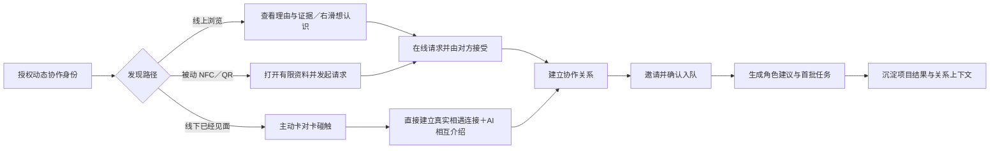

# RALLY｜集结：产品定位与差异化

> 本文统一产品、设计、开发和路演对外口径。它回答三个问题：我们到底是什么、为什么不是另一个社交资料页或 NFC 名片，以及什么现在只是差异、什么未来才可能成为壁垒。

## 1. 定位结论

### 1.0 品牌命名

- **产品名：** RALLY｜集结
- **中文 Slogan：** 找到队友，马上开工。
- **英文 Slogan：** Find your crew. Start building.
- **碰卡传播语：** 碰一下，开始协作。／Tap in. Team up.
- **能力分层：** “协作护照”是身份与证据能力；建联后的启动与关键治理容器称为 `RALLY Room｜项目启动舱`，不是完整执行平台。
- **命名状态：** 黑客松工作品牌已冻结；公开商业发布前仍需完成中英文商标、域名和应用商店重名检索。

### 1.1 一句话产品定义

> **一个面向黑客松和高密度共创现场的实时组队与协作启动产品。**用户通过可授权的 AI 协作护照表达“此刻能贡献什么、正在寻找什么”，系统解释谁值得认识；真实见面后，双方完成确认，并把一次认识直接推进到组队和项目启动。

### 1.2 核心价值主张

> **不只是认识人，而是知道为什么应该一起做事。**

产品不以“认识更多人”作为最终结果，而以“让临时聚集的陌生人更快成为可以共同开工的搭档”作为最终结果。

### 1.3 标准定位陈述

- **For：** 身处黑客松、Game Jam、创客活动或其他高密度共创现场，需要在有限时间内找到项目搭档的 builder；
- **That need：** 快速判断谁当前可合作、能补齐什么缺口、是否有可信能力证据，并降低陌生人开口和组队决策成本；
- **Product category：** 面向个人的实时组队与协作启动产品；
- **That provides：** 从动态协作身份、解释型推荐、现场确认到入队和首批任务的一条连续链路；
- **Unlike：** Builder 社区资料页、约会式互选、职业社交网络、NFC 电子名片、活动名单和微信群；
- **We provide：** 不只交换身份或联系方式，还保存“为什么认识、准备一起做什么”，并把关系推进到共同项目的第一步。

## 2. 真正的差异化是什么

当前最有辨识度的差异不是某一个功能，而是以下五层共同形成的体验闭环。

### 2.1 动态协作身份：表达“此刻的我”

传统个人主页主要回答“我是谁、做过什么”；本产品还必须回答：

- 我现在是否还没有队伍；
- 我今天想做什么；
- 我能够贡献什么；
- 我正在寻找什么角色或能力；
- 我今天可以投入多少时间；
- 我当前的 `Now Building` 是什么；
- 这些信息允许谁看、何时自动失效。

因此，协作护照不是一份永久电子简历，而是与**当前活动、当前项目和当前协作意图**绑定的短效身份。

### 2.2 能力证据：从自我声明走向可核验线索

GitHub、小红书、即刻、抖音、作品集和比赛经历都只是证据来源。AI 可以提取和整理，但不得替用户编造能力，也不得未经确认公开内容。

用户看到的不应只是“精通前端”，而应是：

- 做过什么项目；
- 在项目中承担什么角色；
- 产出过什么可查看的结果；
- 哪些是本人声明，哪些存在外部证据；
- 哪些内容已经由本人逐项授权公开。

### 2.3 解释推荐：不对人公开打分

系统内部可以使用结构化分数进行召回和排序，但不得把复杂的社交与协作判断压缩成用户可见的“匹配度 87%”。

对外展示三类信息：

1. **值得认识的原因：** 例如“可以补齐硬件角色”；
2. **支持判断的证据：** 例如“做过 ESP32 低功耗设备并有演示仓库”；
3. **仍需确认的问题：** 例如“今天能否全程参与尚未确认”。

产品原则是：

> **不对人评分，只解释当前为什么值得认识。**

### 2.4 真实见面与来源化同意：把线上判断带回现场

左右滑动只表达“暂时略过／想认识”，不等于已经建立关系，也不是碰卡的前置步骤。两个人已经在线下交流，并主动把各自绑定账户的 AI Passport 碰在一起时，这个对称物理动作本身构成双方建联授权：系统可直接建立“真实相遇连接”并生成相互介绍。单方面读取被动 NFC、二维码或在线点击无法证明双方都在场，因此只能打开有限资料并发起待确认请求。

无论来源如何，建立 Connection 都不等于自动加入团队，也不得自动公开手机号、微信等敏感联系方式。

实体 AI Passport 的作用是：

- 让“我正在找队友／正在招人”成为现场可见的社交信号；
- 降低陌生人开口和交换身份的摩擦；
- 将线上推荐与真实见面绑定；
- 为现场传播提供有辨识度的物理载体。

硬件不是产品主体。没有工牌时，手机分享链接、被动 NFC 和二维码必须仍能完成软件闭环。

### 2.5 从关系到行动：认识之后马上开始

双方确认后，产品不应停在“交换联系方式”或“进入聊天”：

- 发起或接受团队邀请；
- 看见当前团队的能力覆盖与缺口；
- 由 AI 生成可编辑的角色建议、风险提示和首批三个任务；
- 成员确认角色并领取第一项任务；
- 保存本次连接的活动、项目和推荐上下文。

这一步是产品区别于 NFC 名片和大多数社交产品的关键：**连接不是终点，而是协作的起点。**

## 3. 与主要替代方案的边界

| 替代方案 | 用户主要获得什么 | 通常停在哪里 | 本产品的差异 |
|---|---|---|---|
| Bonjour／Builder 社区 | 聚合账号、作品、标签和个人表达 | 个人主页、社区关系与朋友推荐 | 增加短效协作状态、团队缺口、现场确认和项目启动 |
| Tinder 式社交 | 单人聚焦、快速判断和双向选择 | Match 后聊天 | 借用滑动手势，但判断依据是协作意图和能力证据，结果是组队开工 |
| LinkedIn／脉脉 | 长期职业身份、招聘与职业关系 | 职业连接或岗位转化 | 聚焦“此刻、此场、此项目”，而非长期履历与雇佣关系 |
| NFC 电子名片 | 快速打开主页或交换联系方式 | 存联系人、加好友、进入 CRM | 主动双卡碰触可直接形成真实相遇连接；被动入口仍需确认，之后可继续入队与协作启动 |
| Devpost／TAIKAI 等赛事平台 | 报名、赛事名单、找队友、团队与项目提交 | 单场活动管理和组队工具 | 以个人跨活动身份和关系为主体，保留见面原因及后续协作结果 |
| 微信群／Discord／现场随机交流 | 低门槛广播与即时沟通 | 信息流筛选、加好友、拉群 | 把状态、证据、缺口、请求状态和组队结果结构化并可计量 |

**竞争判断：** 市场并非没有竞争，而是用户目前需要把多个工具拼起来完成一条任务链。我们的机会位于这些类别的断点之间。

## 4. 产品签名闭环

其中，从任一发现路径进入 `G → I → J` 是 96 小时 Demo 必须讲清的纵向闭环；`K` 是长期数据壁垒的起点。

## 5. 哪些不是差异化或壁垒

以下能力可以增强体验，但均容易被复制，不能单独作为路演中的护城河：

- 大模型生成标签、简介或破冰话术；
- Tinder 式左右滑动；
- 导入 GitHub 或社交媒体；
- NFC 碰一下打开网页；
- 电子墨水屏、BLE、二维码或卡片造型；
- 普通个人主页和电子名片；
- 一个未经真实行为验证的推荐算法。

正确的表达是：

> AI、滑动交互和硬件是实现体验的手段；跨阶段闭环是当前差异；真实协作结果形成的数据网络，才是未来可能的壁垒。

## 6. 差异化与壁垒的阶段判断

| 阶段 | 我们实际拥有的东西 | 可以怎么说 | 不能怎么说 |
|---|---|---|---|
| 96 小时 Demo | 一条完整、可演示的协作转化闭环 | “相比单点工具，我们把发现、见面、确认和开工连在一起” | “已经拥有不可复制的 AI 或硬件壁垒” |
| 真实活动试点 | 资料、推荐、碰触、接受、入队和任务启动漏斗 | “我们开始知道什么推荐理由能促成有效组队” | “一次活动数据已经构成网络效应” |
| 跨活动复用 | 经用户确认的能力证据、重复合作和项目结果 | “协作身份会随真实结果变得更可信” | “自填标签就是可信职业声誉” |
| 规模化网络 | 跨活动关系图谱、团队形成和结果反馈 | “更多真实协作结果可以改善下一次推荐” | “用户数量本身等于壁垒” |

### 6.1 潜在壁垒的数据构成

未来真正有积累价值的数据包括：

- 用户确认过的能力证据与实际项目角色；
- 在哪个活动、因为什么理由与谁建立联系；
- 推荐后是否接受、是否入队、是否开始任务；
- 团队最后是否完成项目，成员是否再次合作；
- 哪类能力组合和协作偏好在什么场景下产生了结果；
- 用户可撤回、可校正的协作反馈。

这是一条**可能形成壁垒的路径**，不是已经成立的壁垒。

## 7. 关键产品决策

| ID | 决策 | 产品含义 |
|---|---|---|
| P-01 | 手机端是主体，硬件是可选附加终端 | 产品价值不能依赖用户必须购买工牌 |
| P-02 | 滑动是浏览手势，不是产品定位 | 对外不把产品简单描述为“职业版 Tinder” |
| P-03 | 不展示公开匹配百分比 | 内部排序与对外解释分离，避免伪精确和对人评分 |
| P-04 | 照片用于现场认人，不承担价值判断 | 卡片首屏重点是状态、意图、证据与缺口 |
| P-05 | 同意规则取决于入口 | 主动双卡碰触即双方物理授权，可直接建联；被动 NFC／QR／在线点击只发请求 |
| P-06 | AI 负责提取、解释和建议，不替用户决定 | 所有公开信息、建联、入队和角色均需人确认 |
| P-07 | 连接后必须存在明确下一步 | 至少支持入队、角色建议和首批任务，不停在加好友 |
| P-08 | 保存“为什么认识” | 关系记录必须携带活动、项目、推荐理由和接触方式 |

## 8. 对 96 小时 Demo 的约束

### 8.1 必须被评委看见

1. 用户设置“未组队／团队招人”等短效状态，并选择公开期限；
2. 发现页以单人聚焦方式展示当前意图、能力证据和团队缺口；
3. 推荐卡展示推荐理由与待确认问题，不显示匹配百分比；
4. 用户右滑表达“想认识”，点击查看完整协作护照；
5. 两人主动碰卡后直接形成真实相遇连接；若使用被动 NFC／QR，则发起请求并由对方接受；
6. 一方邀请入队，对方确认后生成角色建议和首批三个任务；
7. 系统记录这次关系的活动、项目与“为什么认识”。

### 8.2 本期不要被带偏

- 不做完整聊天系统和社交信息流；
- 不把附近的人列表搬到墨水屏上；
- 不为了“AI 感”展示无法解释的综合评分；
- 不把社交账号导入做成复杂的全平台真实授权集成；
- 不让硬件承担资料编辑、复杂发现或项目管理；
- 不声称已经形成用户网络、商业闭环或数据壁垒。

## 9. 可证伪的差异化验证

| 假设 | 需要观察的指标 | 失败信号 |
|---|---|---|
| 推荐解释比纯标签更能促成有效交流 | 推荐曝光→查看证据→发起认识的转化；用户能否复述推荐原因 | 用户只看头像或仍需重新阅读全部资料 |
| 动态状态能减少无效寻找 | 被联系时状态有效率；“已组队仍被推荐”比例 | 状态很快失真且用户不更新 |
| 物理碰触提供 QR／微信之外的增量 | NFC／碰卡完成时间、成功率和连接接受率 | 比二维码更慢或用户不愿携带卡片 |
| 连接后的启动包能推动真正协作 | 连接→入队→领取首个任务转化率 | 用户建立关系后直接离开产品 |
| 跨活动身份值得维护 | 7／30 日资料更新、项目补录、再次回应推荐比例 | 活动结束即失活，关系不再复用 |

如果上述结果没有优于“群聊＋微信＋GitHub”的现状，当前差异化只存在于演示叙事中，尚未形成用户价值。

## 10. 路演表达

### 10.1 15 秒版本

> 黑客松现场不缺人，缺的是快速知道谁适合和你一起做事。我们用 AI 协作护照解释彼此为什么值得认识，通过线下碰触确认真实相遇，再把双方直接带到组队和第一项任务。

### 10.2 30 秒版本

> 现在参加黑客松，一个人通常要在微信群、报名表、GitHub 和现场交流之间来回寻找队友；即使加了好友，也经常忘记为什么认识。我们的产品让用户临时授权展示当前协作状态和能力证据，AI 不给人打分，而是解释互补点和待确认问题。两个人主动碰卡就能把已经发生的真实交流保存为数字连接；使用被动入口时仍由对方确认。系统随后继续完成入队、角色建议和首批任务。硬件只是现场入口，真正的产品是从发现到开工的连续协作网络。

### 10.3 对外用词边界

- 可以说：**“借用 Tinder 的单人聚焦和左右滑动，服务协作判断。”**
- 不建议说：**“这是 AI 时代的 Tinder。”** 这会让产品被理解为换皮社交。
- 可以说：**“AI Passport 是现场身份与碰触终端。”**
- 不建议说：**“工牌是核心产品。”** 手机端才是独立产品主体。
- 可以说：**“我们正在验证数据壁垒路径。”**
- 不建议说：**“AI、NFC 或墨水屏已经形成壁垒。”**

## 11. 与其他项目文档的关系

- 市场事实、玩家和商业风险见 [00-市场行业调研.md](./00-市场行业调研.md)；
- 产品功能、状态、权限和验收见 [01-产品设计PRD.md](./01-产品设计PRD.md)；
- 96 小时实现边界见 [02-96小时功能排期表.md](./02-96小时功能排期表.md)；
- AI Passport、NFC／QR 与手机协同见 [03-技术架构与NFC方案.md](./03-技术架构与NFC方案.md)；
- 已有可交互页面与演示方式见 [04-手机端交互Demo.md](./04-手机端交互Demo.md)。
