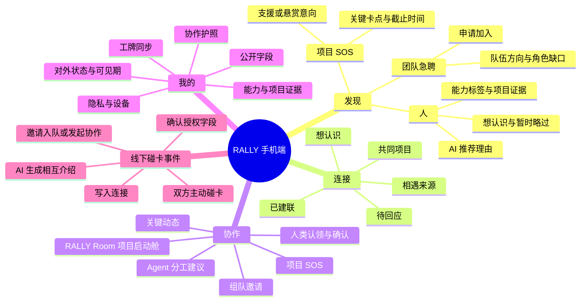

# RALLY｜集结：手机端功能结构与信息架构

> 版本：v0.2
> 日期：2026-08-29
> 状态：导航与启动舱边界已冻结
> 目的：把“发现人”“表达意愿”“碰卡建联”“进入协作”组织成一条连续的手机端产品路径。

## 1. 结论先行

手机端底部导航冻结为四个 Tab：

1. **发现：** 找人、看团队急聘、看项目 SOS；
2. **连接：** 承接想认识、待回应和碰卡后形成的长期关系；
3. **协作：** 承接具体项目的入队、启动进度、分工确认、关键动态和 SOS；
4. **我的：** 管理协作护照、状态、能力证据、公开字段和工牌。

**碰卡不是第四个 Tab。** 它是发生在现实中的跨页事件：两人已经见面并主动碰卡，手机端只负责展示双方授权、相互介绍、建联回执和下一步协作。

**协作护照也不是一个独立的发现方向。** 它是贯穿发现、建联和协作的身份底层；完整编辑、公开字段和设备预览统一放在“我的”。

## 2. 为什么保留四个 Tab

| 当前结构 | 问题 | 调整建议 |
|---|---|---|
| 发现 | 目前主要是“人”，团队急聘和 SOS 缺少稳定入口 | 在发现内建立“人／团队急聘／项目 SOS”三类内容 |
| 连接 | 保存跨活动仍然存在的人际关系和相遇来源 | 独立保留；不能与单个项目启动舱混为一个对象 |
| 项目 | 没有项目的用户会长期看到空页，且名称容易被理解为完整项目管理 | 改名为“协作”，内部承载 `RALLY Room｜项目启动舱` |
| 我的 | 方向正确，但“公开身份”和“设备管理”需明确分层 | 保留，以协作护照为首屏，设备和隐私放入设置 |

## 3. 建议的手机端功能结构

这张图表达的是功能归属和层级关系，而不是用户操作的先后次序。

## 4. 发现页内容层级

发现页在同一个手机端上提供三种浏览方式，三者共用候选人、授权、人物详情和关系状态：

- **推荐：** 按项目缺口和当前状态排序，一屏只聚焦一位候选人；
- **附近：** 手机前台的高功耗现场发现模式，离开本页即停止更新；
- **名册：** 在用户自己的手机上浏览已授权参加本场活动的完整成员。

### 4.1 第一层：快速浏览与现场全貌

- 推荐页采用单人卡片流，不把多人信息压成表格；完整现场全貌由附近和名册承接；
- 不在前端使用 `slice` 设置隐形人数上限；
- AI 只调整排序并解释“为什么建议认识”，不给人展示虚假精确的匹配百分比；
- 当人数增长时，通过分类、搜索、筛选和分页解决，而不是静默截断数据。

### 4.2 第二层：可解释的优先顺序

每张人物或需求卡片优先回答四个问题：

1. 对方现在是什么状态；
2. 对方可以提供什么，或正在寻找什么；
3. 有什么可点开验证的项目证据；
4. 为什么对当前用户或项目值得优先看到。

推荐卡正面只展示以上决策所需的摘要。点击卡片后再进入完整经历、外部证据、待确认项和建联操作，避免用户在刷卡阶段阅读完整简历。

### 4.3 三类内容的主行动

| 内容类型 | 主行动 | 结果 |
|---|---|---|
| 人 | 想认识 | 生成一条可撤回的意愿，不自动建联 |
| 团队急聘 | 申请加入 | 进入双方确认的入队流程 |
| 项目 SOS | 我可以帮 | 创建短时援助会话，不默认加入团队 |

## 5. 线上意愿与线下碰卡的语义

| 用户动作 | 产品语义 | 是否建立正式连接 |
|---|---|---|
| 左滑／暂时略过 | 当前不优先看，不是对人的负面评分 | 否 |
| 右滑／想认识 | 单方表达交流意愿 | 否 |
| 被动 NFC 或二维码 | 打开有限公开页并发起请求 | 需对方确认 |
| 双方主动碰卡 | 两人在场并共同表达建联授权 | 是 |
| 邀请入队 | 将已建立的关系带入某个明确项目 | 需单独确认 |
| 接受 SOS 援助 | 进入一次有期限、有目标的短时协作 | 只建立援助会话 |

## 6. 状态体系如何进入界面

主状态只选一个：

- 正在找队伍；
- 有想法，正在组队；
- 团队补位中；
- 已组队，可交流。

可叠加的实时信号：

- 团队急聘；
- 项目 SOS；
- 可提供支援；
- 暂无额外需求。

主状态回答“我和团队的关系”，实时信号回答“我此刻在现场的需求”。一个已组队用户仍可以同时是“项目 SOS＋可提供支援”。

## 7. 手机端与数字工牌的分工

| 能力 | 手机端 | 数字工牌 |
|---|---|---|
| 编辑资料与授权 | 主端 | 不承担 |
| 推荐／附近／活动名册 | 全部交互；附近发现只在手机前台开启 | 不扫描、不显示附近人员、不承担名册浏览 |
| 展示自己的状态 | 编辑与预览 | 主要公开面 |
| 推荐理由与证据 | 完整展示 | 只显示最小提示，或不显示 |
| 碰卡与建联结果 | 显示确认、相互介绍和后续行动 | 发起物理事件并给出最小成功反馈 |
| 项目、分工确认和 SOS | 伴随操作；复杂编排由电脑端 RALLY Room 承担 | 只显示一个当前状态，不复制手机信息架构 |

## 8. 96 小时 Demo 中应保留的展示闭环

1. 用户组装并授权公开协作护照；
2. 发现页同时看到人、团队急聘和项目 SOS；
3. 点开任意人物，看到能力证据、推荐理由和待确认项；
4. 用户可单独表达“想认识”；
5. 两人可跳过线上意愿，在现实交流后直接碰卡建联；
6. 建联只保存协作关系；若方向未定，双方先完成由人主导的意图澄清并确认“服务谁／解决什么／验证什么”；
7. 方向确认后才创建项目、邀请入队，RALLY Room 再生成角色覆盖、风险和首批任务；
8. 成员认领／调整并由人确认方案，证明产品闭环从“认识”走到“开工”。

SOS 悬赏在 96 小时内只建议演示金额、交付标准和双方确认，**不接入实际支付和资金托管**。

## 9. 已冻结与待验证问题

1. **已冻结：** 保留“发现／连接／协作／我的”四 Tab；
2. **待验证：** 发现页的默认首屏是“人”，还是“人＋现场急迫需求”混合信息流；
3. **待验证：** 项目 SOS 悬赏是否只做视觉原型，不进入 96 小时可用功能。

## 附录 A：图表规划记录

| 项目 | 内容 |
|---|---|
| 图表目的 | 让产品发起人和开发团队快速看懂手机端功能归属，以及碰卡为什么不是 Tab |
| 受众 | 三人黑客松团队、评委演示文档维护者 |
| 使用位置 | 本信息架构文档 |
| 基本规则检查 | 图中存在四个产品入口和一个线下事件分支，纯列表会弱化“碰卡是跨页事件”的关系 |
| 图表类型 | Mindmap；用于功能层级，不表达时序 |
| 节点清单 | 根节点1个；四个产品一级入口＋一个线下事件分支；其余节点表达功能归属 |
| 深度 | 最多4层，符合 Mindmap 可读性限制 |
| 备选图表 | Flowchart；不采用，因为本图不试图表达交互流程先后关系 |

### 验证清单

- [x] 图表展示层级和跨模块触发关系，不是线性步骤；
- [x] 深度不超过 4 层；
- [x] 每个分支的直接子节点不超过 6 个；
- [x] 图中没有依赖颜色表达语义；
- [x] 已用 `%% MEANING` 注释说明图表意图；
- [ ] 待飞书知识库渲染环境进行最终预览。
